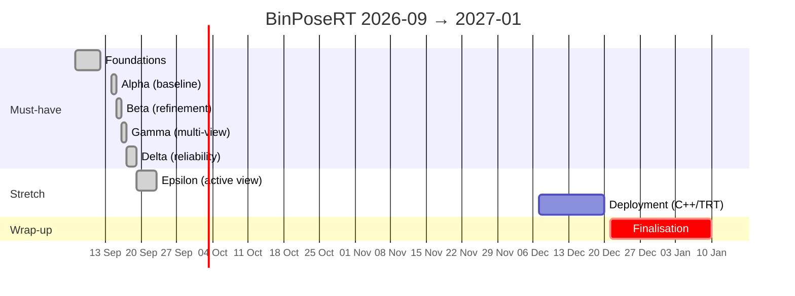

# BinPoseRT — Milestone Plan

The dated, task-level schedule for the whole project. It expands the gate table in
[`DECISIONS.md §3`](DECISIONS.md#3-milestones) and the increment list in
[D19](DECISIONS.md#d19--increment-plan); those remain the *decision*, this file is the *plan*.
Exit criteria here are copied from DECISIONS.md verbatim — if they ever disagree, DECISIONS.md wins and
this file is fixed.

Vocabulary follows [`CONTEXT.md`](../CONTEXT.md). Ablation IDs (A0–A11) refer to
[DECISIONS.md §4](DECISIONS.md#4-ablation-matrix).

## Timeline at a glance

Budget (D2): ~16 weeks, 14–20 h/week, from mid-September 2026 to early January 2027. Each milestone below
is planned at three weeks (≈ 45–60 h); the two stretch milestones share two weeks and are cut first if
anything slips. Finalisation is protected: it never shrinks to absorb overrun.

| # | Milestone | Weeks | Planned dates | Runs on | Ablations | Status |
|---|---|---|---|---|---|---|
| 1 | **Foundations** | 0 | — 2026-09-12 | laptop | — | **done 2026-09-12** |
| 2 | **Alpha** — baseline | 1–3 | 2026-09-14 → 2026-10-04 | GPU (adapters once), then laptop | A0, A1, A5 | **done 2026-09-15** |
| 3 | **Beta** — refinement | 4–6 | 2026-10-05 → 2026-10-25 | GPU machine (CPU only, from Alpha's caches) | A2, A3, A4 | **done 2026-09-16** |
| 4 | **Gamma** — multi-view | 7–9 | 2026-10-26 → 2026-11-15 | GPU machine (CPU from caches; GPU once for XYZ-IBD) | A6, A7 | **done 2026-09-17** |
| 5 | **Delta** — reliability | 10–12 | 2026-11-16 → 2026-12-06 | GPU machine (CPU only, from Gamma's caches) | A8 | **done 2026-09-19** |
| 6a | **Epsilon** — active view *(stretch)* | 13–14 | 2026-12-07 → 2026-12-20 | GPU machine (CPU only, from Delta's caches) | A9 | **closed 2026-09-23** (exit criterion not met — negative result with a measured ceiling) |
| 6b | **Deployment** *(stretch)* | 13–14 | 2026-12-07 → 2026-12-20 | GPU machine | A10 | not started |
| 7 | **Finalisation** | 15–17 | 2026-12-21 → 2027-01-10 | — | — | not started |

The critical path is **Alpha → Gamma → Delta → Finalisation**: Delta needs multi-view QualitySignals
from Gamma, Gamma needs cached coarse hypotheses from Alpha, and the report needs Delta's calibration
figures. Beta is on the path too (refinement signals feed both fusion weights and Model H), but its
ablations A3/A4 can be trimmed to a single registration variant without blocking anything downstream.

## Rules that apply to every milestone

- A milestone is **closed** only when every item in its exit criterion holds, `uv run pytest` is green on
  the laptop (< 60 s, no GPU, no network — D16), and the *Increment status* table in DECISIONS.md is
  updated with the date. The status column above is updated at the same time.
- Every geometry stage lands with a synthetic-truth test in `tests/synth/` before its first real-data run
  (D16). "Recovers known truth" is the bar; a real-data number is not a test.
- Every experiment row is one command (`tools/run.py experiment=A<n> dataset=<d>`) that writes a BOP CSV,
  a `run_manifest.json`, and its plots under `outputs/` (D12). Numbers in README / report only ever come
  from those directories.
- GPU work is batched: adapters run once per dataset, outputs are rsync'd to the laptop, and every
  downstream stage runs locally from the cache (D1). If a milestone needs a GPU session, it is the *first*
  task of that milestone so the wait overlaps laptop work.
- Directories in [D18](DECISIONS.md#d18--repository-layout) are created when their milestone starts, not
  before.

---

## Milestone 1 — Foundations ✅

**Goal.** A CPU-only core that loads BOP data, renders, handles symmetry and evaluates against GT, with
the project's vocabulary and decisions written down.

**Completed 2026-09-12.** 30 tests, < 10 s, laptop only.

Delivered:
- `README.md`, `CONTEXT.md`, `docs/DECISIONS.md` (D1–D19), ADRs 0001–0004
- `pyproject.toml` + `uv.lock`, CI on CPU (lint, type-check, tests)
- `binposert/types.py`, `transforms.py`, `symmetry/`, `render/` (Open3D RaycastingScene, 22 ms @ 640×480),
  `data/` (BOP loader + writer), `evaluate/` (ADD / ADI / MSSD / MSPD / VSD reimplemented, BOP CSV)
- `tests/fixtures/mini_bop/` (0.2 MB, 2 scenes × 2 Views × 3 objects) regenerated by `tools/make_mini_bop.py`
- `tools/download_bop.py`

**Exit criterion (met):** `uv sync && uv run pytest` green on the laptop; mini fixture loads → evaluate →
BOP CSV; renderer, symmetry, transforms tested.

---

## Milestone 2 — Alpha: single-view baseline ✅

**Weeks 1–3 · 2026-09-14 → 2026-10-04 · A0, A1, A5 · closed 2026-09-15**

**Goal.** Cached zero-shot Detections and coarse PoseHypotheses for T-LESS from CNOS, FoundPose and
MegaPose, consumed by a reproducible local pipeline that yields a deterministic BOP AR.

**Why first.** Everything downstream reads these caches. "Estimator environment hell" is the top risk
(§5) and has the longest wall-clock, so it starts on day one.

### Tasks

Week 1 — GPU side (start immediately; laptop tasks run in parallel while images build)
- [x] `docker/cnos/`, `docker/foundpose/`, `docker/megapose/`: one Dockerfile each, upstream commit pinned (D15)
      — plus `requirements.txt` / `upstream.env` / `patch.sh` per estimator and
      `tools/setup_estimator_env.sh` building the same environment as a host venv (the GPU machine
      at hand has no NVIDIA Container Toolkit and no root; images are untested until one does)
- [x] `adapters/cnos_cli.py`, `foundpose_cli.py`, `megapose_cli.py`: read BOP, write D12 artefacts
      (Detections → masks PNG + Parquet; PoseHypotheses → Parquet with `stage=coarse` and QualitySignals)
- [x] Download T-LESS test split + models on the GPU machine; smoke-run each adapter on one scene
      (CNOS: 3 images, masks IoU ≈ 0.9 vs GT; FoundPose: 2 images; MegaPose: import-level only —
      the GPU holds one estimator at a time)
- [x] Full T-LESS runs: CNOS (1000 images, 62,751 detections, 5.5 h), FoundPose on GT masks and on CNOS
      masks (30 object representations 2.5 h once, then 0.37 s per instance), MegaPose on CNOS masks
      (multi-hypothesis, 12 s per image) — all cached under `outputs/tless/test_primesense/`; rsync to
      laptop pending

Week 2 — Laptop side
- [x] `binposert/segment/`: `Segmenter` interface, `GroundTruthSegmenter`, CNOS cache reader (D4)
- [x] `binposert/pose/`: `PoseEstimator` interface, FoundPose / MegaPose cache readers (D3);
      `GroundTruthPerturbedEstimator` for plumbing tests
- [x] `binposert/pipeline/`: stage DAG, content-addressed cache with `_SUCCESS`, `run_manifest.json`,
      Hydra entry `tools/run.py` (D12)
- [x] `configs/`: `dataset/tless.yaml`, `segmenter/`, `estimator/`, `experiment/A0.yaml A1.yaml A5.yaml`
      (+ `smoke.yaml`; group directories are singular, see D12/D18)
- [x] Tests: cache hash stability (same inputs → same hash, config change → new hash), stage skip on
      `_SUCCESS`, adapter output schema round-trips through the readers, mini-fixture end-to-end via `run.py`,
      external stage stub; 44 tests, < 10 s

Week 3 — Results and closure
- [x] `tools/bop_eval.sh`: official `bop_toolkit` evaluation in its own env on the GPU machine (D15)
- [x] Core metrics vs official toolkit agree: on a 6423-instance T-LESS run (GT + 6 mm / 8° noise)
      AR 16.15 vs 16.06, VSD 5.42 / 5.39, MSSD 22.69 / 22.59, MSPD 20.33 / 20.20 after aligning the
      core with `eval_bop19_pose` (valid GT = `inst_count` most visible, pooled recall, bop19 VSD);
      the residual is the 36-step vs 315-step symmetry sampling
- [x] A0 / A1 / A5 on T-LESS, official `bop_toolkit` (core in brackets):
      A0 GT masks + FoundPose **59.2** (59.0) · A1 CNOS + FoundPose **35.4** (35.2) · A5 CNOS + MegaPose
      **48.2** (48.0) — see [`results_alpha_tless.md`](results_alpha_tless.md)
- [x] First stratified report: AR by visibility bin [0.10, 0.30), [0.30, 0.60), [0.60, 1.00]
      (`summary.md` / `report.json` of every evaluate stage; `tools/report.py` aggregates rows)
- [x] `binposert/viz/`: pose overlay renderer; failure gallery (worst 20 by MSSD, `tools/gallery.py`)
- [x] Update DECISIONS.md increment status; adapter quirks noted under D3/D4/D12/D15/D18

### Exit criterion (met 2026-09-15)
`tools/run.py experiment=A0 dataset=tless` yields a BOP CSV and deterministic AR from cached FoundPose
outputs; A1 with CNOS.

### Deliverables
Three Docker specs (images unbuilt on the first GPU machine — no container toolkit; the same pinned
environments ran as host venvs) · three adapters · `outputs/tless/test_primesense/{segment,coarse_pose,
evaluate}/…` cached · A0/A1/A5 AR table · failure galleries for all three rows
(`outputs/…/evaluate/<hash>/gallery/`).

### What the numbers say
- FoundPose-coarse with GT masks: MSPD 82 but VSD/MSSD ≈ 50 — poses are right in the image plane and
  wrong in depth; the worst-20 gallery is heavily occluded objects placed far behind the scene. That is
  the regime Beta's depth refinement and silhouette gate address.
- CNOS costs 24 AR points. 15 % of target instances receive no prediction at all, and AR is 1 % below
  30 % visibility; the A1 worst-20 are one family: CNOS's *top-scoring* proposal for a large object is a
  small fragment elsewhere, so the BOP `n_top = inst_count` rule never poses the real one. Detection-score
  unreliability, not pose estimation, dominates — motivation for Delta's learned confidence.
- MegaPose (refined, multi-hypothesis) on the same masks recovers most of the depth gap (VSD 45.6 vs 27.4)
  while MSPD stays capped by the same misses; its `pose_score` separated the two failures in the smoke
  run cleanly.

### Risks specific to this milestone
| Risk | Response |
|---|---|
| An estimator's upstream repo does not build | Pin an older commit; if still blocked after 2 days, ship with the other estimator and log it under D3. MegaPose (A5) is a comparator and can slip to Beta. |
| Adapter output format churn | Freeze the Parquet schema in `binposert/types.py` before writing adapters; readers validate columns. |
| GPU machine unavailable | Every laptop task above proceeds on the mini fixture; only the AR numbers wait. |

---

## Milestone 3 — Beta: depth-based refinement

**Weeks 4–6 · 2026-10-05 → 2026-10-25 · A2, A3, A4 · answers RQ-A, RQ-B · done 2026-09-16 (ahead of plan)**

**Goal.** A Refinement stage that improves coarse hypotheses with depth, rejects its own failures through
an independent gate, and is measured before/after by initial-error and visibility regime.

**Result.** T-LESS official AR 35.4 → **47.8** (A2, point-to-plane); robust 47.9, GICP 47.3. Most of the
gain is a depth initialisation of the translation added during the milestone; the D8 silhouette gate
turned out to reject good candidates and was demoted to a signal. Full write-up:
[`results_beta_tless.md`](results_beta_tless.md); every decision taken on the way, with its evidence:
[`milestone_beta_decision.md`](milestone_beta_decision.md).

### Tasks

Week 4 — Geometry
- [x] `binposert/refine/`: depth → cloud, visibility-aware model crop (render at coarse pose, keep visible
      surface), masked scene cloud extraction
- [x] ICP variants behind one signature: point-to-plane, robust (Tukey/Huber), GICP (Open3D)
- [x] Synthetic tests: small perturbation recovered; large perturbation → rejected; noise sweep
- [x] *Added:* translation initialisation from depth along the viewing ray (`refine/depth_init.py`) —
      FoundPose coarse poses are right in the image and wrong in depth (median 25 mm, 52 % beyond 0.25 d)

Week 5 — Gate and signals
- [x] Acceptance gate (D8): rendered-silhouette IoU + boundary error vs Detection mask; displacement cap
      `α = 0.25 · diameter`, `β = 30°` symmetry-aware; rejection returns the coarse hypothesis with
      `rejection_reason`
- [x] QualitySignals populated: registration fitness, RMSE, depth coverage, silhouette IoU, displacement
- [x] Tune α, β on T-LESS *val* only (scenes 1, 6, 11, 16; checked on the other 16); record chosen values
      in `configs/refiner/` — the sweep also covered the silhouette and fitness thresholds: α 0.6, β 90°,
      silhouette checks off (signals only), fitness ≥ 0.3
- [x] Tests: gate rejects a wrong-but-converged ICP result; symmetry-aware rotation cap on obj 1 (cylinder)

Week 6 — Experiments and closure
- [x] `configs/experiment/A2.yaml A3.yaml A4.yaml`; run on T-LESS from Alpha's caches (`tools/run_beta.sh`)
- [x] *Added:* `configs/experiment/A5r.yaml` — the matrix's "best" refine column for A5 (`ONLY=A5r BEFORE=A5 tools/run_beta.sh`)
- [x] Stratified before/after: AR by initial-error bin [0, 5), [5, 10), [10, 20), [20, ∞) mm × visibility bin,
      tables + figure (`binposert/evaluate/refinement.py`, `tools/refine_report.py`)
- [x] Gate rejection rate and *precision of rejection* (strict and at the 0.1 d success level), per check
- [x] Pick "best" registration variant for downstream configs; justify in DECISIONS.md D8 change log —
      point-to-plane (tied best, fastest)
- [x] Failure gallery: refinement made it worse (accepted), refinement rejected a good pose
      (`binposert/viz/refine_gallery.py`)

### Exit criterion
Before/after refinement AR on T-LESS, stratified by initial-error bin and visibility; gate rejection
rate reported. **Met:** [`results_beta_tless.md`](results_beta_tless.md) — AR by initial error
93.5 → 84.5 / 86.6 → 85.5 / 75.0 → 85.9 / 19.6 → 37.3 (core, all scenes), × visibility; rejection rate
7.5 % (tuned gate) vs 30.7 % (D8 default), precision of rejection 99.7 % at the success level.

### Deliverables
`binposert/refine/` · A2/A3/A4 stratified tables + plots · chosen defaults for α, β and registration
variant · gallery. All delivered: tables and the strata figure in `results_beta_tless.md`
(`figures/beta_strata_tless.png`), galleries under each refine stage's `analysis/` (two in `figures/`),
defaults in `configs/refiner/*.yaml`.

### What was learned (beyond the plan)
- Open3D 0.19's parallel raycaster corrupts its output under multi-process load; rendering is
  single-threaded per worker now (D8 renderer note), and the evaluate stage was re-run for A1.
- The refinement's remaining regressions are the already-good poses (within 5 mm: 93.5 → 84.5) and
  wrong-instance detections. The first has a cause: ICP moves near-perfect poses by a constant
  ~2.5 mm along camera y (same for both estimators; fitness/RMSE look perfect) — a depth↔RGB offset of
  the T-LESS Primesense data. Not corrected in Beta (would mean tuning against test GT); Gamma should
  estimate it GT-free from depth/RGB edge alignment.
- *Added row A5r* (CNOS → MegaPose → Beta stage): 48.2 → 46.9 official AR. The depth initialisation
  helps MegaPose too (42 → 61 % per-hypothesis success) but ICP gives a third back through the same
  offset, and MegaPose has far more already-good poses to damage. Estimator dependency answered: the
  stage is for RGB-only coarse poses; on a depth-aware estimator only the initialisation is worth keeping.
- Costs: 0.8–1.0 s per hypothesis single-threaded (≈ 5 renders + 3 ICP stages); the Delta update-path
  budget (p95 < 200 ms) will need a GPU renderer or a smaller crop. *(Delta's profile: 0.28 s per
  hypothesis on a quiet machine, half of it inside Open3D's ICP — see Milestone 6b.)*

### Risks specific to this milestone
| Risk | Response | Outcome |
|---|---|---|
| Depth refinement hurts on average (§5) | The stratified table is the result either way; the gate's job is to make the *accepted* subset better. Report the regimes where it helps. | Helps on average (+12 AR); hurts only the < 5 mm regime, reported. |
| Three registration variants take too long | A3 and A4 are cuttable to one variant; A2 (point-to-plane) is the must-have. | All three ran (8 min per row on 15 cores). |

---

## Milestone 4 — Gamma: multi-view association and fusion ✅

**Weeks 7–9 · 2026-10-26 → 2026-11-15 · A6, A7 + extrinsic perturbation sweep · answers RQ-C · closed 2026-09-17**

**Goal.** Repeated objects associated correctly across calibrated Views and fused into one symmetry-aligned
`T_world_object` per ObjectTrack, with an AR-vs-views curve on XYZ-IBD.

### Tasks

Week 7 — GPU session first, then geometry
- [x] Download XYZ-IBD on the GPU machine (10.7 GB without `train_pbr`, D5); CNOS + FoundPose adapters
      on the val split (the test split has no public GT); rsync of the caches to the laptop still pending
- [x] `binposert/data/`: XYZ-IBD loader quirks (multi-camera extrinsics, any format deviations) as config,
      not code, where possible
- [x] `binposert/multiview/association.py`: geometric gating + Hungarian assignment, one-to-one per View,
      unassigned allowed (D10)
- [x] Synthetic test: 3 copies, 2 cameras, one occluded → exactly 3 ObjectTracks

Week 8 — Fusion
- [x] `binposert/multiview/fusion.py`: symmetry-align to highest-weight reference (D9), weighted
      Lie-algebra mean (D10 step 3), initial hand-set weights
- [x] Joint multi-view ICP polish reusing `refine/` unchanged against the union masked world-frame cloud,
      gated exactly as D8
- [x] Multi-view QualitySignals: view count, hypothesis dispersion, joint-ICP fitness, multi-view residual
- [x] Synthetic tests: 3 noisy views → better than best single view; 137° about cylinder axis → error ≈ 0
      after alignment; fusion of hypotheses in different symmetry branches does not corrupt the mean

Week 9 — Experiments and closure
- [x] Multi-view debug on T-LESS (several image_ids of one scene, D5) before touching XYZ-IBD
- [x] `configs/experiments/A6.yaml A7.yaml`; rows: best single view / mean only / mean + joint ICP
- [x] AR vs number of views {1, 2, 3, 4} with error bars (bootstrap over scenes), stratified by visibility
- [x] Extrinsic perturbation sweep: δt ∈ {0, 1, 2, 5, 10} mm × δθ ∈ {0, 0.1, 0.25, 0.5, 1}° → multi-view AR
- [x] Association correctness on repeated objects (track purity / completeness vs GT)
- [x] Gallery: mis-associations, symmetry-branch flips

### Exit criterion (met 2026-09-17)
XYZ-IBD 1/2/3/4-view AR curve with error bars (22.6 → 30.9 → 36.5 → 38.3, 95 % bootstrap over 15 val
scenes; `docs/results_gamma_xyzibd.md`); association correctness on repeated objects (purity 89–93 %,
completeness 86–89 % on 10–59 copies per bin). Verified by `tools/check_gamma.py --dataset xyzibd`
(123 checks) and on T-LESS (`docs/results_gamma_tless.md`).

### Deliverables
`binposert/multiview/` · XYZ-IBD caches on the GPU machine (laptop rsync pending) · AR-vs-views figures
(`docs/figures/gamma_*_curve.png`) · perturbation heat-maps (`gamma_*_sweep.png`) · association metrics ·
galleries (`<fuse dir>/analysis/gallery/`) · decision log `docs/milestone_gamma_decision.md` (G1–G20).

### Risks specific to this milestone
| Risk | Response |
|---|---|
| XYZ-IBD download / adapter runs eat the whole milestone | Start day 1; develop and test on T-LESS multi-view in the meantime. If XYZ-IBD is still not cached by week 9, close the gate on T-LESS multi-view and carry XYZ-IBD numbers into Delta week 10. |
| Calibration error dominates | The perturbation sweep quantifies it; dataset extrinsics are trusted as given (§5). |
| Symmetry corrupts fusion | Alignment happens in the object frame before any averaging; the cylinder test guards it. |

---

## Milestone 5 — Delta: confidence and verdict ✅

**Weeks 10–12 · 2026-11-16 → 2026-12-06 · A8 · answers RQ-D · closed 2026-09-19**

**Goal.** Every FusedPose carries a calibrated Confidence and a Verdict, and the calibration is measured
honestly on held-out data.

### Tasks

Week 10 — Schema and data
- [x] `binposert/confidence/schema.py`: versioned QualitySignals field list; NaN → constant + indicator
      flag so single-view and multi-view rows share one schema (D11)
- [x] Labelled table builder: every refined PoseHypothesis and FusedPose from Beta/Gamma caches with
      `success = MSSD < 0.1 · diameter` (`tools/build_confidence_table.py`)
- [x] Split discipline: fit on *val*, evaluate on *test*; no T-LESS/XYZ-IBD leakage across splits
      (val = T-LESS {1, 6, 11, 16} + XYZ-IBD {0, 20, 40, 60}; Δ2)
- [x] Synthetic test: synthetic pass/fail signals → AUC > 0.9

Week 11 — Models
- [x] Model H (per PoseHypothesis): logistic regression on QualitySignals; feed its probability into
      fusion weights as an optional D10 weighting and measure the AR delta (A8w rows)
- [x] Model F (per FusedPose): logistic regression on aggregated track signals → the published Confidence
- [x] Calibration analysis: ROC-AUC, PR-AUC, Brier, ECE, reliability diagram, risk–coverage curve
- [x] MLP comparator only if logistic clearly under-fits (D11); record the decision either way (kept
      logistic: +1 pt AUC, worse calibration)
- [x] Verdict thresholds τ_acc, τ_rej chosen on val for a target precision; reported with the resulting
      accept / reject / request_view rates

Week 12 — Integration and closure
- [x] `confidence` stage wired into the DAG; `FusedPose` artefact gains `confidence` and `verdict` columns
- [x] `configs/experiments/A8.yaml`; full pipeline A8 on T-LESS and XYZ-IBD
- [x] Feature-importance / ablate-one-signal table (which QualitySignals carry the prediction)
- [x] Gallery: confident failures (high Confidence, wrong pose) — the most important figure in the report
- [x] **Profiling pass** (D6 precondition): per-stage timings of the update path in Python; note candidates
      for C++ ports
- [x] Update DECISIONS.md; **freeze scope** — after this gate nothing new enters the must-have list

### Exit criterion (met 2026-09-19)
Models H / F fitted on the val scenes (`models/confidence/v1/`); held-out ROC-AUC 91.1 / 92.4, PR-AUC
90.7 / 90.7, Brier 0.127 / 0.112, ECE 8.1 / 4.5 % (Model F on T-LESS 3.0 %); reliability diagrams and
risk–coverage curves in `outputs/confidence/v1/`; every FusedPose of the A8 rows carries Confidence +
Verdict. The Verdict bands chosen for 95 / 90 % precision deliver 89 / 84 % held out — the
pre-registered val scenes are the easiest of both datasets; leave-one-scene-out shows the targets are
reachable with representative fit scenes. Verified by `tools/check_delta.py` (136 checks); tables in
`docs/results_delta.md`.

### Deliverables
`binposert/confidence/` · fitted model files + versioned schema (`models/confidence/v1/`, card) ·
calibration figure set (`docs/figures/delta_*.png`) · Verdict thresholds · confident-failure gallery ·
update-path profile (`outputs/tless_update_path_profile.json`) · decision log
`docs/milestone_delta_decision.md`.

### Risks specific to this milestone
| Risk | Response |
|---|---|
| Too few failures to fit on (T-LESS after refinement) | Pool T-LESS + XYZ-IBD val; add a controlled-perturbation augmentation of GT poses as additional negatives, clearly labelled as such. *(Not needed: 41–53 % of rows are failures.)* |
| Calibration looks good only in-distribution | Report per-dataset ECE separately; cross-dataset fit/eval as an extra row. *(Done: ranking transfers, calibration does not — ECE 12–19 % cross-dataset.)* |
| *(hit)* The val scenes are unrepresentative | Reported as is; leave-one-scene-out rows show the achievable calibration; a representative val split is a Finalisation note, not a post-hoc re-selection. |

---

## Milestone 6a — Epsilon: uncertainty-driven next-best-view *(stretch)* ✅ (exit criterion not met)

**Weeks 13–14 · 2026-12-07 → 2026-12-20 · A9 · answers RQ-E · started 2026-09-19 · closed 2026-09-23**

Attempted only if Delta closed on time. Shares the two-week window with Deployment; pick the one with
the better expected story for the report (Epsilon by default — it is laptop-only and produces a figure).
*Started 2026-09-19 on the GPU machine (CPU only) straight after Delta (E1).*

### Tasks
- [x] `binposert/active/`: NBV score over the Scene's real, not-yet-used Views — `U(v)` = mean pairwise
      silhouette disagreement of the top-K aligned hypotheses rendered into `v`, `V(v)` = predicted visible
      fraction (D14) — *the hypothesis set is the aligned members plus posterior samples of the fused
      pose (E3); the score weights tracks by `1 − Confidence` or its entropy (E4, E10)*
- [x] Loop: 1 View → fuse → Verdict; on `request_view` unlock argmax; repeat until accept / reject / exhaustion
      (`binposert/active/loop.py`, the `nbv` stage; E8)
- [x] Baselines: fixed-1, fixed-2, fixed-all, random-next — *plus a GT-scored `oracle` as the ceiling (E11)*
- [x] Synthetic test: disagreement in one view → that view wins (`tests/test_active.py`: the View across
      the observing ray beats the View along it; occlusion lowers `V`; symmetric members do not disagree)
- [x] `configs/experiment/A9.yaml`; AR-vs-views-used curve, NBV vs random-next, on XYZ-IBD (all four
      start groups, 60 episodes) and T-LESS (start group 0, 20 episodes) — `tools/run_epsilon.sh`,
      `tools/nbv_report.py`, verified by `tools/check_epsilon.py` (0 failures)
- [x] Simulated pick: `T_robot_gripper = T_robot_world @ T_world_object @ T_object_gripper` with a
      hand-authored grasp pose per ObjectModel, visualised in Open3D (`binposert/viz/grasp.py`,
      `models/grasps/xyzibd.json`, `tools/grasp_demo.py`)

### Exit criterion
NBV over real views beats random-next on AR-vs-views; grasp transform chain visualised.
**Met in part** (`docs/results_epsilon.md`): the grasp chain is implemented, tested and drawn.
**NBV does not beat random next** — on the full run (XYZ-IBD all four start groups, 60 episodes;
T-LESS group 0, 20 episodes) NBV, random and the strided order lie within one paired 95 % interval
at every budget on both datasets (XYZ-IBD NBV − random −1.14 / −0.85 / +0.93 pt at 2 / 3 / 4 Views),
while a GT-scored oracle shows the ceiling is +7 / +9 / +10 pt (T-LESS +13 / +17 / +11): a View's
worth is the copies the detector finds in it (ρ = 0.71 XYZ-IBD / 0.62 T-LESS with the oracle's
gain), not its geometry (ρ = 0.04 / 0.10). The Verdict-stopped loop is a worse allocator than a
fixed budget (D14 as written; §E12). Closed as a negative result with a measured ceiling, not
re-opened for a different score — RQ-E's answer is "no, and here is why."

### Deliverables
`binposert/active/` · `nbv` stage · A9 rows (`outputs/runs/A9_*`, 171+ manifests) · AR-vs-views +
paired-difference figure (`docs/figures/epsilon_xyzibd_curve.png`) · oracle ceiling and its
correlates · grasp file, pick figure (`docs/figures/epsilon_xyzibd_pick_scene0.png`) · decision log
`docs/milestone_epsilon_decision.md` (E1–E12) · `tools/check_epsilon.py` (0 failures) ·
`docs/results_epsilon.md`.

---

## Milestone 6b — Deployment: profiling and C++ ports *(stretch)*

**Weeks 13–14 · 2026-12-07 → 2026-12-20 · A10 · answers RQ-F**

Attempted only after Delta's profile shows a clear hot path. `cpp/` does not exist before this
(ADR-0001). *Delta's profile (`outputs/tless_update_path_profile.json`, Δ16): the update path is
0.51 s median / 0.74 s p95 per track, 95 % of it the refinement (0.28 s per hypothesis); inside the
refinement 49 % is Open3D's `registration_icp` — already C++ — 20 % numpy reductions over
full-resolution masks, 13 % tensor ↔ numpy conversions, 8 % rebuilding the pinhole ray grid per
render. A port of the Python parts can at best halve the refine time; the 200 ms target needs a
cheaper ICP schedule (fewer levels / iterations / points, the Pareto below) or a GPU registration,
so the "C++ ports" task is reframed: profile-guided Python fixes first (ray-grid cache, reductions
on the crop), then the ICP schedule sweep, and C++ only if a Python-side hot spot remains.*

### Tasks
- [ ] Freeze `configs/benchmark.yaml`: 50 warm-up, 1000 timed, batch 1, CUDA synchronised, `perf_counter`
      per stage (D13)
- [ ] `tools/benchmark.py`: update-path and full-pipeline latency, stage-level median / p90 / p95, peak
      VRAM / RAM, one documented GPU machine
- [ ] Port the 1–3 slowest geometry stages to C++17 via pybind11 behind unchanged Python signatures
      (candidates: visibility-aware crop, ICP inner loop, depth → cloud); before/after per stage
- [ ] Optional: ONNX / TensorRT export of the DINOv2 backbone used by CNOS / FoundPose
- [ ] Accuracy–latency Pareto plot (x = p95, y = BOP AR) — a required figure for the report even if only
      Python points exist
- [ ] Bit-for-bit (or tolerance) equivalence tests between Python and C++ implementations

### Exit criterion
Profile → 1–3 C++ ports → update-path p95 reported; optional ONNX/TensorRT of the DINOv2 backbone.

---

## Milestone 7 — Finalisation

**Weeks 15–17 · 2026-12-21 → 2027-01-10**

**Goal.** The portfolio deliverables (D2): a reviewer with two minutes sees the README; one with thirty
reads the report.

### Tasks

Week 15 — Numbers and figures
- [ ] Re-run every must-have ablation from a clean `outputs/` on a tagged commit; archive manifests
- [ ] `tools/plot.py`: every report figure regenerated from `outputs/` by one command
- [ ] README: fill the Key results table with measured numbers and links to the producing run manifests;
      one-sentence latency statement per ADR-0004
- [ ] Failure galleries curated (one per milestone: segmentation, refinement, association, confidence)

Week 16 — Report and model card
- [ ] `docs/report/`: 6–10 page paper-style report — problem, system, ablations A0–A8 (+A9/A10 if done),
      failure analysis, limitations, reproduction instructions
- [ ] Model card: hardware, datasets, splits, known failure modes, what "RT" does and does not mean
- [ ] Reproduction check: fresh clone → `uv sync` → `uv run pytest` → one ablation from cached outputs,
      on a machine that has never seen the repo

Week 17 — Video and release
- [ ] 60–90 s demo video: bin → Detections → PoseHypotheses → ObjectTracks → FusedPose with Confidence and
      Verdict; NBV loop if Epsilon shipped
- [ ] Tag `v1.0.0`; public repo hygiene (license headers, CI badge, issue templates optional)
- [ ] Final DECISIONS.md change-log entry; close the Increment status table

### Exit criterion
README with measured numbers, report, video, failure galleries, model card.

### Deliverables (from DECISIONS.md §6)
Public repository · Docker images for the three estimators · dataset download/convert scripts · CAD
onboarding tool · benchmark scripts (one command per ablation) · results CSV/JSON + plots · 60–90 s video ·
6–10 page report · model card.

---

## Slip policy

Decided up front so it is not decided under pressure:

1. **Stretch goes first.** If Delta is not closed by 2026-12-06, weeks 13–14 become Delta overflow and
   both stretch milestones are dropped. RQ-E and RQ-F are then reported as "not attempted".
2. **Within a milestone, comparator rows go before the must-have row.** A5 (MegaPose), A3/A4 (registration
   variants), A7 (3–4 views) can be dropped; A0, A1, A2, A6, A8 cannot.
3. **Finalisation is fixed at three weeks.** A report on fewer ablations beats no report.
4. **Datasets:** ITODD-MV and IPD are never on the schedule; they are only added if a milestone closes early.
5. Every slip is recorded in the DECISIONS.md change log with the date and what was cut.

## Status log

| Date | Event |
|---|---|
| 2026-09-12 | Foundations closed. Plan written. |
| 2026-09-14 | Alpha started on the GPU machine. `binposert/data/` found missing from the Foundations commit (an unanchored `data/` in `.gitignore`); rebuilt from its tests. Pipeline, plugins, adapters, host environments, evaluator parity with bop_toolkit done in one day; CNOS full run started (~4 h), FoundPose / MegaPose rows queued behind it (`tools/run_alpha.sh`). |
| 2026-09-19 | Epsilon started on the GPU machine from Delta's caches. `nbv` stage (the D14 loop as one stage over in-memory association / fusion / confidence), synthetic tests, A9 rows for start group 0 on XYZ-IBD and T-LESS (NBV, random, strided, entropy-weight ablation, GT oracle, Verdict-stopped loop), grasp chain + Open3D pick figure. |
| 2026-09-23 | Epsilon closed: XYZ-IBD start groups 1–3 finished (60 episodes total), T-LESS held at group 0 as a cross-check. Confirmed on the full run: NBV, random next and the strided order lie within one paired 95 % interval at every budget on both datasets (exit criterion not met); a GT-scored oracle's ceiling is +7 / +9 / +10 pt (XYZ-IBD) and +13 / +17 / +11 (T-LESS) at 2 / 3 / 4 Views, and its gain correlates 0.71 / 0.62 with the detector's success in the candidate image against 0.04 / 0.10 with the D14 geometric score — a View's worth on these bins is the copies the detector finds in it. The Verdict-stopped loop underperforms a fixed budget. Reported as a negative result with a measured ceiling (E12). |
| 2026-09-15 | Alpha closed: A0 59.2 / A1 35.4 / A5 48.2 official AR on T-LESS. Evaluator aligned with `eval_bop19_pose` (three protocol deviations fixed), parallel over scenes (25 → 7 min). MegaPose needed a numpy hand-off patch for its forked render workers. Total GPU wall time ≈ 13 h on a Pascal TITAN X. |
