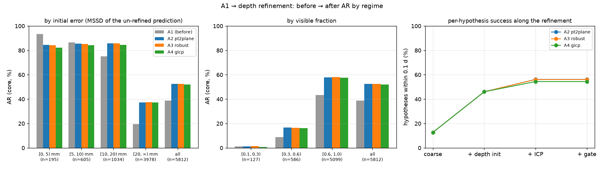
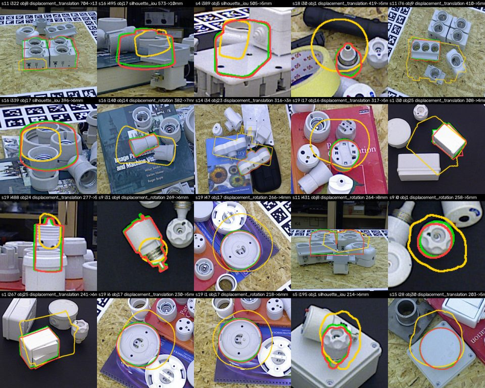
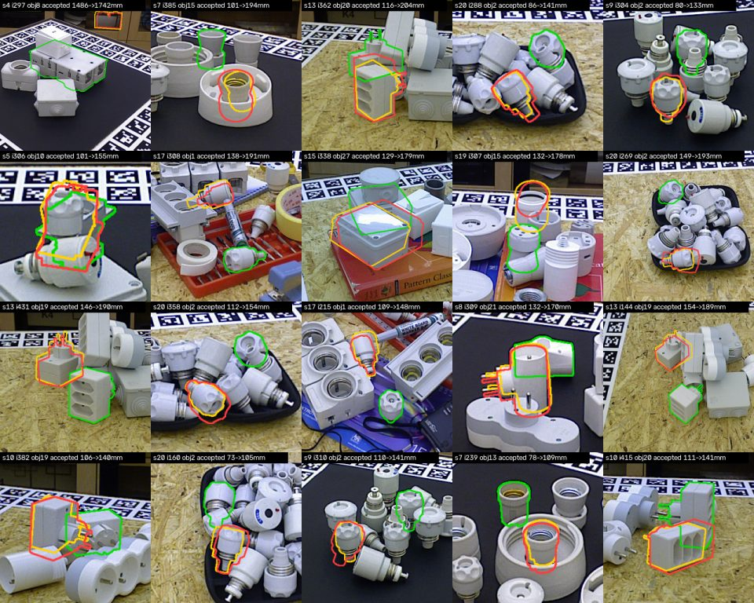

# Beta results — T-LESS

Milestone 3 (depth-based refinement, D8) on top of the Alpha A1 row: CNOS masks → FoundPose coarse
pose → **depth initialisation + ICP + gate** → BOP19 localisation on the T-LESS test targets (1,000
images, 6,423 instances). AR in %, official `bop_toolkit` numbers unless marked *core*. Rows A2 / A3 / A4
differ only in the registration variant behind one `register()` signature; A1 is the un-refined input.
The decisions behind these numbers, in order and with evidence: [`milestone_beta_decision.md`](milestone_beta_decision.md).

## Headline

| Row | Refinement | AR | VSD | MSSD | MSPD | rejected | median s / hyp |
|---|---|---|---|---|---|---|---|
| A1 | — (un-refined input) | 35.4 | 27.4 | 30.1 | 48.6 | — | — |
| A2 | depth init + point-to-plane ICP + gate | **47.8** | 41.4 | 50.6 | 51.4 | 7.5% | 0.79 |
| A3 | depth init + Tukey-robust ICP + gate | **47.9** | 41.4 | 50.7 | 51.5 | 6.1% | 0.85 |
| A4 | depth init + GICP + gate | **47.3** | 40.6 | 50.3 | 51.0 | 5.0% | 0.99 |

- **Depth helps (RQ-A): +12 AR points**, almost all of it in the depth-sensitive metrics (VSD +14,
  MSSD +20, MSPD +2). The image-plane accuracy FoundPose already had is kept.
- **Most of the gain is the depth initialisation, not ICP.** FoundPose coarse poses are right in the
  image and wrong along the viewing ray (median depth error 25 mm; 52 % beyond 0.25 d; up to 5 m).
  Scaling the translation along the ray so the rendered depth matches the observed depth inside the
  mask takes the share of hypotheses within 0.1 d from 12.7 % to 46.0 %; ICP takes it to 56 %.
- **The registration variant barely matters (RQ-B):** point-to-plane, Tukey-robust and GICP are within
  0.5 AR points; point-to-plane is the fastest and is the default (`configs/refiner/pt2plane.yaml`).
- **The D8 silhouette gate did not earn its keep.** As designed (IoU ≥ 0.5, IoU drop ≤ 0.1, α = 0.25 d,
  β = 30°) it rejected 31 % of hypotheses, 6 good candidates per bad one, and cost 1.3 AR points. The
  CNOS mask is the evidence the coarse pose was fitted to, so agreeing with it is not independent
  evidence of a correct pose; and the caps rejected exactly the large corrections the depth
  initialisation makes possible. Tuned on the val scenes and confirmed on the 16 held-out scenes, the
  gate is now: fitness ≥ 0.3 (never rejects a success), α = 0.6 d, β = 90°, silhouette checks off —
  silhouette IoU, displacement and fitness are still measured and stored as QualitySignals for the
  Delta confidence model.
- **Estimator dependency (A5r): on top of MegaPose's own refiner the stage costs 1.3 AR points.** The depth
  initialisation still helps (42 → 61 % per-hypothesis success) but ICP then moves near-perfect poses by a
  constant ~2.5 mm along camera y — a depth↔RGB offset of the sensor data that also caps the FoundPose rows.

## Where refinement helps: before → after AR by initial error and visibility

Initial error = MSSD of the closest un-refined prediction to the GT instance (core metric, pooled
over GT). Refinement **hurts the instances that were already within 5 mm** (93.5 → 84.5 on 195: the
depth initialisation and ICP move a near-perfect pose by a few millimetres, which the 0.05–0.1 d
thresholds punish), is neutral at 5–10 mm, lifts the 10–20 mm bin by 11 points and nearly doubles
the ≥ 20 mm bin (19.6 → 37.3 on 3978, where most instances are). Visibility below 0.3 stays hopeless
(the coarse pose is wrong-instance or absent there). The 611 GT instances without any un-refined
prediction cannot be helped by refinement (CNOS misses). A gate that could recognise the "already
good" regime would recover ~2 points; none of the measured signals separates it (see the sweep).

| exp | [0, 5) mm | [5, 10) mm | [10, 20) mm | [20, ∞) mm | all | no pred |
|---|---|---|---|---|---|---|
| A2 | 93.5 → 84.5 (195) | 86.6 → 85.5 (605) | 75.0 → 85.9 (1034) | 19.6 → 37.3 (3978) | 38.9 → 52.6 (5812) | 611 |
| A3 | 93.5 → 84.2 (195) | 86.6 → 85.3 (605) | 75.0 → 85.7 (1034) | 19.6 → 37.5 (3978) | 38.9 → 52.6 (5812) | 611 |
| A4 | 93.5 → 82.3 (195) | 86.6 → 84.3 (605) | 75.0 → 84.6 (1034) | 19.6 → 37.2 (3978) | 38.9 → 52.1 (5812) | 611 |

### By initial error × visibility

**A2 (pt2plane)**

| initial \ visibility | [0.1, 0.3) | [0.3, 0.6) | [0.6, 1.0) | all |
|---|---|---|---|---|
| [0, 5) mm | — | 89.7 → 76.1 (3) | 93.5 → 84.6 (192) | 93.5 → 84.5 (195) |
| [5, 10) mm | — | 80.5 → 57.3 (5) | 86.7 → 85.7 (600) | 86.6 → 85.5 (605) |
| [10, 20) mm | 60.3 → 60.3 (1) | 75.4 → 86.9 (17) | 75.0 → 85.9 (1016) | 75.0 → 85.9 (1034) |
| [20, ∞) mm | 0.7 → 0.8 (126) | 5.7 → 13.8 (561) | 22.6 → 42.7 (3291) | 19.6 → 37.3 (3978) |
| all | 1.2 → 1.2 (127) | 8.8 → 16.6 (586) | 43.3 → 58.0 (5099) | 38.9 → 52.6 (5812) |

**A3 (robust)**

| initial \ visibility | [0.1, 0.3) | [0.3, 0.6) | [0.6, 1.0) | all |
|---|---|---|---|---|
| [0, 5) mm | — | 89.7 → 74.9 (3) | 93.5 → 84.3 (192) | 93.5 → 84.2 (195) |
| [5, 10) mm | — | 80.5 → 76.9 (5) | 86.7 → 85.4 (600) | 86.6 → 85.3 (605) |
| [10, 20) mm | 60.3 → 74.7 (1) | 75.4 → 86.7 (17) | 75.0 → 85.7 (1016) | 75.0 → 85.7 (1034) |
| [20, ∞) mm | 0.7 → 0.9 (126) | 5.7 → 13.6 (561) | 22.6 → 43.0 (3291) | 19.6 → 37.5 (3978) |
| all | 1.2 → 1.4 (127) | 8.8 → 16.5 (586) | 43.3 → 58.0 (5099) | 38.9 → 52.6 (5812) |

**A4 (gicp)**

| initial \ visibility | [0.1, 0.3) | [0.3, 0.6) | [0.6, 1.0) | all |
|---|---|---|---|---|
| [0, 5) mm | — | 89.7 → 70.3 (3) | 93.5 → 82.5 (192) | 93.5 → 82.3 (195) |
| [5, 10) mm | — | 80.5 → 77.7 (5) | 86.7 → 84.4 (600) | 86.6 → 84.3 (605) |
| [10, 20) mm | 60.3 → 0.0 (1) | 75.4 → 83.6 (17) | 75.0 → 84.7 (1016) | 75.0 → 84.6 (1034) |
| [20, ∞) mm | 0.7 → 0.8 (126) | 5.7 → 13.3 (561) | 22.6 → 42.7 (3291) | 19.6 → 37.2 (3978) |
| all | 1.2 → 0.8 (127) | 8.8 → 16.2 (586) | 43.3 → 57.5 (5099) | 38.9 → 52.1 (5812) |

## Gate

Per-hypothesis view: every hypothesis scored against its closest GT before (coarse), after the depth
initialisation (init), after ICP (candidate = gate off) and after the gate (final). *precision
strict* = the rejected candidate was no closer to GT than the coarse pose; *precision success* = the
rejected candidate was not within 0.1 d, i.e. rejecting it cost nothing. *accepted worse* is dominated
by wrong-instance detections (CNOS masked another copy of the same object; both poses fail for the
target instance) — the real regressions are the *broke* column.

| exp | n | rejected | reasons | precision strict / success | rejected good | avoided break | accepted worse | broke | fixed | rf coarse | rf gate off | rf final | success coarse → init → gate off → final |
|---|---|---|---|---|---|---|---|---|---|---|---|---|---|
| A2 | 5400 | 406 (7.5%) | fitness 163, displacement_rotation 122, icp_failed 49, no_depth 23, no_overlap 23, displacement_translation 19, depth_window 7 | 26.0 / 99.7 | 1 | 1 | 578 | 65 | 2412 | 46.4 | 59.9 | 60.0 | 12.7 → 46.0 → 56.2 → 56.2 |
| A3 | 5400 | 332 (6.1%) | fitness 150, displacement_rotation 62, icp_failed 60, no_overlap 24, no_depth 23, depth_window 7, displacement_translation 6 | 24.8 / 100.0 | 0 | 0 | 595 | 62 | 2403 | 46.4 | 60.1 | 60.1 | 12.7 → 46.0 → 56.1 → 56.1 |
| A4 | 5400 | 271 (5.0%) | fitness 99, displacement_rotation 65, icp_failed 41, no_depth 23, no_overlap 23, displacement_translation 13, depth_window 7 | 33.3 / 99.4 | 1 | 0 | 625 | 84 | 2333 | 46.4 | 59.7 | 59.7 | 12.7 → 46.0 → 54.4 → 54.4 |

Per check (gate rejections only): n · strict precision · success precision · rejected good · avoided break

- A2: fitness: 163 · 33.1 · 100.0 · 0 · 1; displacement_rotation: 122 · 18.9 · 99.2 · 1 · 0; displacement_translation: 19 · 10.5 · 100.0 · 0 · 0
- A3: fitness: 150 · 34.7 · 100.0 · 0 · 0; displacement_rotation: 62 · 3.2 · 100.0 · 0 · 0; displacement_translation: 6 · 0.0 · 100.0 · 0 · 0
- A4: fitness: 99 · 44.4 · 99.0 · 1 · 0; displacement_rotation: 65 · 16.9 · 100.0 · 0 · 0; displacement_translation: 13 · 30.8 · 100.0 · 0 · 0

### Gate as designed in D8 (before tuning)

Same three rows with the D8 default gate (α = 0.25, β = 30°, IoU ≥ 0.5, IoU drop ≤ 0.1, fitness ≥ 0.3).
Official AR: A2 46.5, A3 46.5, A4 45.9. Full report:
[`outputs/tless_beta_report_gate_d8_default.md`](../outputs/tless_beta_report_gate_d8_default.md).

| exp | n | rejected | reasons | precision strict / success | rejected good | avoided break | accepted worse | broke | fixed | rf coarse | rf gate off | rf final | success coarse → init → gate off → final |
|---|---|---|---|---|---|---|---|---|---|---|---|---|---|
| A2 | 5400 | 1659 (30.7%) | displacement_rotation 463, displacement_translation 388, silhouette_iou_drop 316, silhouette_iou 227, fitness 163, icp_failed 49, no_depth 23, no_overlap 23, depth_window 7 | 17.4 / 88.2 | 172 | 15 | 386 | 51 | 2248 | 46.4 | 59.9 | 58.5 | 12.7 → 46.0 → 56.2 → 53.4 |
| A3 | 5400 | 1593 (29.5%) | displacement_rotation 381, silhouette_iou_drop 355, displacement_translation 314, silhouette_iou 279, fitness 150, icp_failed 60, no_overlap 24, no_depth 23, depth_window 7 | 16.4 / 87.2 | 174 | 12 | 406 | 50 | 2236 | 46.4 | 60.1 | 58.6 | 12.7 → 46.0 → 56.1 → 53.2 |
| A4 | 5400 | 1753 (32.5%) | silhouette_iou_drop 476, displacement_rotation 461, displacement_translation 335, silhouette_iou 288, fitness 99, icp_failed 41, no_depth 23, no_overlap 23, depth_window 7 | 17.9 / 83.8 | 238 | 28 | 387 | 56 | 2112 | 46.4 | 59.7 | 58.0 | 12.7 → 46.0 → 54.4 → 50.8 |

Per check (gate rejections only): n · strict precision · success precision · rejected good · avoided break

- A2: displacement_rotation: 463 · 14.5 · 92.9 · 33 · 0; displacement_translation: 388 · 11.1 · 96.1 · 15 · 0; silhouette_iou_drop: 316 · 24.4 · 68.7 · 88 · 14; silhouette_iou: 227 · 13.2 · 84.1 · 36 · 0; fitness: 163 · 33.1 · 100.0 · 0 · 1
- A3: displacement_rotation: 381 · 13.6 · 92.7 · 28 · 1; silhouette_iou_drop: 355 · 20.8 · 67.9 · 98 · 11; displacement_translation: 314 · 7.6 · 97.1 · 9 · 0; silhouette_iou: 279 · 14.7 · 86.0 · 39 · 0; fitness: 150 · 34.7 · 100.0 · 0 · 0
- A4: silhouette_iou_drop: 476 · 24.4 · 62.4 · 149 · 28; displacement_rotation: 461 · 14.3 · 93.5 · 30 · 0; displacement_translation: 335 · 10.4 · 94.9 · 17 · 0; silhouette_iou: 288 · 12.5 · 85.8 · 41 · 0; fitness: 99 · 44.4 · 99.0 · 1 · 0

### Threshold sweep on the val scenes {1, 6, 11, 16}

`tools/refine_report.py` re-decides every stored hypothesis under a grid over α, β, min IoU, max IoU
drop and min fitness (720 combinations) and scores the result; the choice is validated on the other
16 scenes. Run on the D8-default rows (the sweep does not depend on which gate produced the table):

| exp | default | objective | best | objective | gain | chosen | held-out rf | held-out success | held-out net successes | held-out rejected |
|---|---|---|---|---|---|---|---|---|---|---|
| A2 | (0.25, 30, 0.5, 0.1, 0.3) | 57.4 | (0.6, 90, 0, 1, 0.3) | 59.1 | +1.70 | (0.6, 90, 0, 1, 0.3) *changed* | 58.7 → 60.2 | 53.1 → 55.9 | -132 → +0 | 29.9% → 7.1% |
| A3 | (0.25, 30, 0.5, 0.1, 0.3) | 57.3 | (0.6, inf, 0, 1, 0) | 58.6 | +1.24 | (0.6, inf, 0, 1, 0) *changed* | 58.9 → 60.4 | 53.0 → 55.9 | -138 → +0 | 28.7% → 2.2% |
| A4 | (0.25, 30, 0.5, 0.1, 0.3) | 57.0 | (0.4, 90, 0, 0.2, 0) | 58.4 | +1.41 | (0.4, 90, 0, 0.2, 0) *changed* | 58.2 → 59.8 | 50.6 → 54.2 | -177 → -6 | 31.3% → 7.5% |

The top of the sweep is flat: with the silhouette checks off, anything from (0.4 d, 90°) to a fully
open gate is within 0.1 pt; the fitness check costs nothing and flags 3 % certain failures.

## Estimator dependency: refinement on top of MegaPose (A5r)

The ablation matrix gives A5 a "best" refine column; Alpha ran A5 un-refined (MegaPose brings its own
RGB refiner). A5r adds the tuned Beta stage on top of A5's cached poses.

| Row | Coarse pose | Refinement | AR | VSD | MSSD | MSPD | rejected |
|---|---|---|---|---|---|---|---|
| A5 | MegaPose (own refiner) | — | **48.2** | 45.6 | 45.9 | 53.0 | — |
| A5r | MegaPose (own refiner) | depth init + point-to-plane ICP + gate | **46.9** | 40.8 | 49.5 | 50.3 | 8.4 % |

**Depth refinement hurts MegaPose by 1.3 AR points**, and the per-hypothesis ladder says exactly where:
success (MSSD < 0.1 d) coarse 42.0 % → depth init **61.0 %** → ICP **55.2 %** → gate 55.3 %. The depth
initialisation helps MegaPose as much as it helps FoundPose; ICP then gives a third of that back. By
initial error (core AR, all scenes): 97.8 → 86.1 (1228) · 91.5 → 86.4 (1267) · 79.9 → 84.4 (771) · 4.3 → 7.6 (2552) · 53.0 → 51.5 (5818) · 605 — MegaPose's poses are mostly already good (2495 of 5818 within 10 mm), and that is the regime the stage damages.

| initial \ visibility | [0.1, 0.3) | [0.3, 0.6) | [0.6, 1.0) | all |
|---|---|---|---|---|
| [0, 5) mm | — | 98.4 → 73.3 (19) | 97.8 → 86.3 (1209) | 97.8 → 86.1 (1228) |
| [5, 10) mm | — | 91.5 → 71.6 (23) | 91.5 → 86.7 (1244) | 91.5 → 86.4 (1267) |
| [10, 20) mm | 81.0 → 6.7 (1) | 80.3 → 75.5 (15) | 79.8 → 84.6 (755) | 79.9 → 84.4 (771) |
| [20, ∞) mm | 0.4 → 0.9 (126) | 3.5 → 6.4 (529) | 4.8 → 8.4 (1897) | 4.3 → 7.6 (2552) |
| all | 1.1 → 1.0 (127) | 12.0 → 12.9 (586) | 59.0 → 57.2 (5105) | 53.0 → 51.5 (5818) |

### Why ICP damages near-perfect poses — a systematic offset, not noise

For hypotheses that are within 0.05 d *after* the depth initialisation, ICP's move and its effect:

| Row | n near-perfect | MSSD change (median / 90 %) | worsened | pushed past 0.1 d | ICP move in camera frame (mean dx, dy, dz) | rotation | fitness / RMSE |
|---|---|---|---|---|---|---|---|
| A2 (FoundPose) | 721 (14 % of accepted) | +1.1 / +3.7 mm | 72 % (95 % for d < 90 mm) | 44 | +0.4, **+2.2**, −0.0 mm | 3.9° | 0.96 / 1.5 mm |
| A5r (MegaPose) | 2314 (47 %) | +2.1 / +4.6 mm | 91 % (98 % for d < 90 mm) | 175 | +0.6, **+2.5**, −0.1 mm | 2.9° | 0.96 / 1.5 mm |

The move is the same for both estimators and points the same way: **+2.2–2.5 mm along camera y**, a few
tenths in x, nothing in z. Fitting the depth image therefore lands ~2.5 mm below where the GT says the
object is — a constant offset between T-LESS's Primesense depth and the RGB/GT frame (≈ 4 px at 700 mm),
not a registration failure: fitness and RMSE are as good as they get, so no gate signal can see it. For
objects under 90 mm, 2.5 mm is most of the 0.05 d MSSD threshold, which is why the [0, 5) mm bin drops
in every row. Not corrected in Beta — subtracting an offset estimated against test GT would be tuning
on the benchmark. Follow-up (Gamma, where registration is revisited for joint multi-view ICP): estimate
the depth↔RGB offset *without GT* from depth-edge / RGB-edge alignment on the val scenes, and apply it
as a sensor calibration.

## Failure galleries

Green = ground truth, yellow = coarse pose, red = ICP candidate (the D8-default rows, where the gate
made the most mistakes). The two A2 galleries are committed under `figures/`:

**Rejected a good pose** — coarse poses off by hundreds of millimetres along the ray, candidates on the
GT, rejected for "moving too far" or for disagreeing with the mask:

**Accepted but worse** — almost all wrong-instance detections: the mask (and coarse pose) sit on another
copy of the same object; ICP correctly registers to the object under the mask:

All galleries (per row, per kind), on the machine that ran the rows:

- A2 accepted worse: [`outputs/tless/test_primesense/refine/cbbca7cfd5be174c/analysis/gallery/accepted_worse.png`](../outputs/tless/test_primesense/refine/cbbca7cfd5be174c/analysis/gallery/accepted_worse.png)
- A2 rejected good: [`outputs/tless/test_primesense/refine/cbbca7cfd5be174c/analysis/gallery/rejected_good.png`](../outputs/tless/test_primesense/refine/cbbca7cfd5be174c/analysis/gallery/rejected_good.png)
- A3 accepted worse: [`outputs/tless/test_primesense/refine/cdb555f0e60f6df7/analysis/gallery/accepted_worse.png`](../outputs/tless/test_primesense/refine/cdb555f0e60f6df7/analysis/gallery/accepted_worse.png)
- A3 rejected good: [`outputs/tless/test_primesense/refine/cdb555f0e60f6df7/analysis/gallery/rejected_good.png`](../outputs/tless/test_primesense/refine/cdb555f0e60f6df7/analysis/gallery/rejected_good.png)
- A4 accepted worse: [`outputs/tless/test_primesense/refine/cd0910fa3e187f6f/analysis/gallery/accepted_worse.png`](../outputs/tless/test_primesense/refine/cd0910fa3e187f6f/analysis/gallery/accepted_worse.png)
- A4 rejected good: [`outputs/tless/test_primesense/refine/cd0910fa3e187f6f/analysis/gallery/rejected_good.png`](../outputs/tless/test_primesense/refine/cd0910fa3e187f6f/analysis/gallery/rejected_good.png)

## Method notes

- Val / held-out: the gate was tuned on scenes 1, 6, 11, 16 (943 hypotheses) and the choice checked on
  the remaining 16 scenes; the headline numbers are on all 20 scenes, as in Alpha.
- The per-hypothesis view uses MSSD + MSPD recall fractions (no VSD, no top-n matching) and is used
  only to judge decisions; every AR number comes from the evaluate stage (core) or `bop_toolkit`.
- Open3D 0.19's parallel raycaster corrupts its output under multi-process load; all rendering is
  single-threaded per worker since this milestone (D8 renderer note), and the evaluate stage version
  was bumped — A1 was re-evaluated (35.2 core, unchanged).
- Costs on the 16-core machine: refinement 0.8–1.0 s per hypothesis single-threaded (≈ 5 renders +
  3 ICP stages), 8 min per row with 15 workers; the Delta update-path budget will need the renderer
  on the GPU or a smaller crop.

## Provenance

- tuned gate (headline): A1 evaluate `outputs/tless/test_primesense/evaluate/5c87b9f56431de00`; A2 evaluate `outputs/tless/test_primesense/evaluate/31bc1c0b37436ae3`; A3 evaluate `outputs/tless/test_primesense/evaluate/2d91e3702fa38124`; A4 evaluate `outputs/tless/test_primesense/evaluate/c0a345b374f3955a`
- D8 default gate: A1 evaluate `outputs/tless/test_primesense/evaluate/5c87b9f56431de00`; A2 evaluate `outputs/tless/test_primesense/evaluate/b17e103d4ae5d086`; A3 evaluate `outputs/tless/test_primesense/evaluate/520654e4616ccd29`; A4 evaluate `outputs/tless/test_primesense/evaluate/40f8786265cf26cc`
- Refine stages (tuned), `outputs/tless/test_primesense/refine/<hash>/` with `refine_details.parquet` and `analysis/`: A2 `fef89a2555638bc0`, A3 `735a052897d127e4`, A4 `f6a455169e82a5f9`; D8-default: A2 `cbbca7cfd5be174c`, A3 `cdb555f0e60f6df7`, A4 `cd0910fa3e187f6f`
- Generated by `tools/run_beta.sh` → `tools/refine_report.py --before A1 A2 A3 A4`; reports `outputs/tless_beta_report.md` (tuned) and `outputs/tless_beta_report_gate_d8_default.md`; figure `outputs/tless_beta_strata.png` (copied to `figures/`).
- A5r: `ONLY=A5r BEFORE=A5 tools/run_beta.sh` → `outputs/tless_beta_report_A5r.md`; A5 re-evaluated at evaluate v7 (`2cb827213634ff5d`, 48.0 core, unchanged), A5r evaluate `177972eef3b611f7`, refine `fea00e72359170c2`.
- Code: the Beta commits on `main` (see git log); Alpha caches: segment `1bf69ec3bd0bb040`, coarse_pose `b15c0a0ec32b33ef`.
