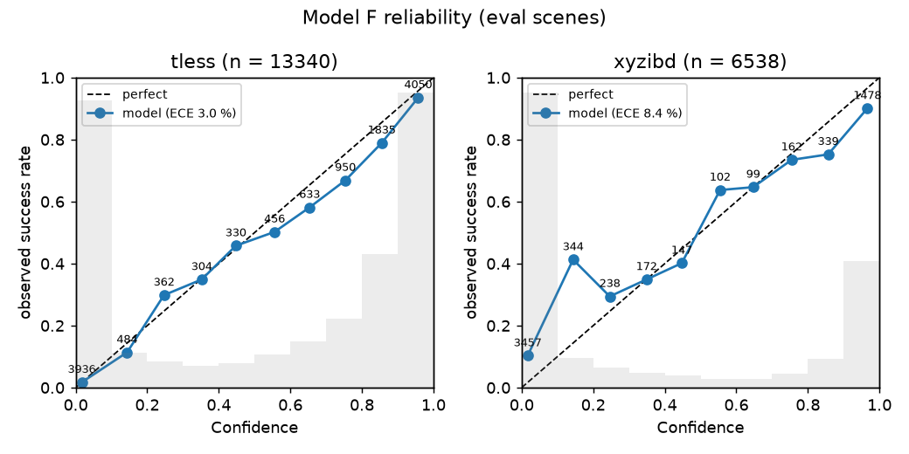
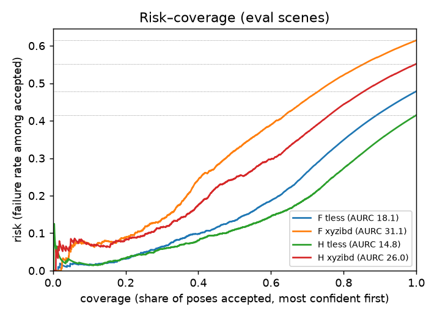
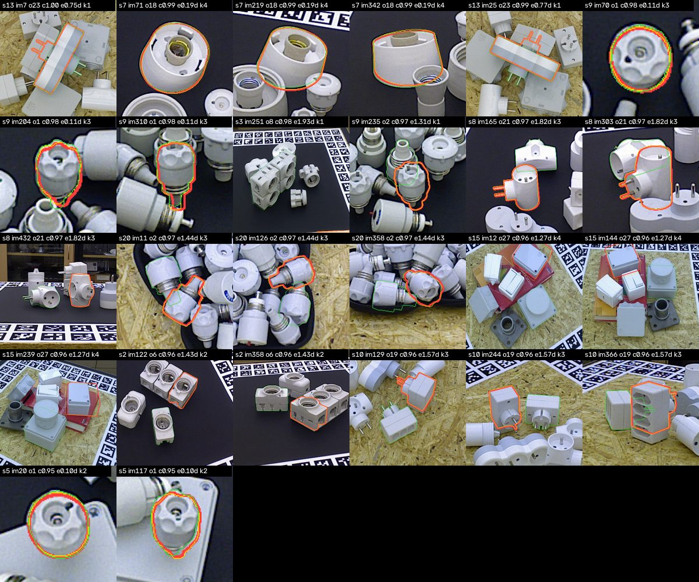
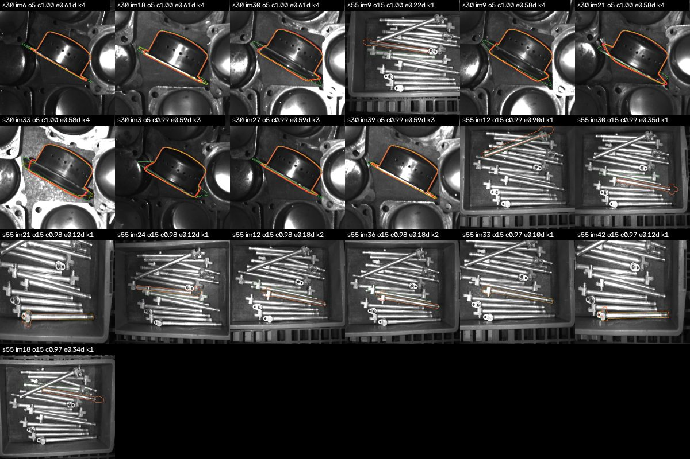

# Delta results — calibrated Confidence and Verdict (T-LESS + XYZ-IBD)

Milestone 5, closed 2026-09-19 (started 2026-09-17). Research question RQ-D: *can a small calibrated model predict pose
failure reliably (ROC-AUC, Brier, ECE, risk–coverage)?* Decisions in
[`milestone_delta_decision.md`](milestone_delta_decision.md); the tool-written analysis is
`outputs/confidence/v1/report.md` (`tools/fit_confidence.py`), the pipeline rows are
`outputs/{tless,xyzibd}_delta_report.md` (`tools/confidence_report.py`). Every number here comes from
those files.

## Summary

- **Two logistic models on one versioned schema.** Model H scores a refined PoseHypothesis from its
  QualitySignals (15 signals + missing indicators, distances in diameters); Model F scores a
  FusedPose from the track's aggregated signals, its shape and its members' Model H probabilities.
  Fitted on 8 val scenes (4 per dataset, 1 901 hypotheses / 5 638 FusedPoses), recalibrated on
  out-of-fold logits; JSON weights in `models/confidence/v1/`.
- **Held-out discrimination is 0.90–0.93 ROC-AUC on both datasets** (pooled 91.1 / 92.4 for H / F)
  and rises with the view count (Model F: 0.90 at k = 1 → 0.96 at k = 4 on T-LESS): a fused pose
  that several Views agree on is easy to vouch for. Model F's ECE is 3.0 % on T-LESS, but the error
  sits where the thresholds are: the 0.5–0.9 bins are 5–9 pt over-confident, the extreme bins (60 %
  of the rows) exact. On XYZ-IBD it is 8.4 %, under-confident on the lowest bin, where half the rows sit.
- **The Verdict thresholds do not transfer at the target precision.** Chosen on the val scenes for
  95 % / 90 % band precision they deliver 89 % / 84 % on the held-out scenes, because the val
  scenes — every fifth scene, fixed before Delta (B1) — turned out to be the easiest of both datasets
  (leave-one-scene-out AUC 0.98 on them vs 0.92 on the others). With representative fit scenes
  (leave-one-scene-out over all 35, thresholds chosen on one half of the scenes and scored on the
  other) the same models reach ECE 2.2–2.6 % and the accept band holds its 95 % precision while
  covering 18–26 % of the poses, with 24–35 % deferred (72–73 % of those right); the reject band's
  precision swings between 85 and 97 % with the half it was chosen on.
- **Discrimination transfers across datasets, calibration does not**: fitted on one dataset the models
  keep ~0.90 AUC on the other but ECE grows to 12–19 %.
- **FoundPose's own `pose_score` hurts on held-out scenes** (ablating it: +1.1 / +0.7 pt AUC for H / F);
  the ICP residual in diameters carries both models (−1.1 / −1.0 pt without it), then the silhouette
  IoU and, for Model F, the members' dispersion.
- An MLP on the same features and protocol gains 0.4 / 0.5 pt AUC with the same Brier; logistic is
  kept (D11).
- A8 pipeline rows (BOP score = Confidence) and the Model-H-weighted fusion: see §6.

## 1. Data and split

| dataset | scenes (fit / eval) | hypotheses (success %) | FusedPoses k = 1 / 2 / 3 / 4 (success %) |
|---|---|---|---|
| T-LESS test_primesense | {1, 6, 11, 16} / 16 others | 5 452 (58.7) | 5 452 (58.7) / 4 265 (52.9) / 3 407 (47.4) / 2 981 (43.4) |
| XYZ-IBD val (camera xyz) | {0, 20, 40, 60} / 11 others | 3 111 (46.7) | 3 111 (46.7) / 2 372 (39.7) / 2 002 (35.7) / 1 926 (32.1) |

Success = `MSSD < 0.1 · diameter` against the nearest same-object annotation (all annotations,
BOP validity recorded); a FusedPose is scored in the world frame against the annotations of every
View of its group. The per-track success rate falls with k because correct hypotheses merge into one
track while wrong ones fail the association gate and stay separate (Δ11). Tables:
`outputs/confidence/<dataset>/{hypotheses,fused,members}.parquet` (`tools/build_confidence_table.py`).

## 2. Model H — per refined PoseHypothesis (held-out scenes)

| rows | n | success % | ROC-AUC | PR-AUC | Brier | ECE % | AURC % | coverage @ 5 % risk | @ 10 % risk |
|---|---|---|---|---|---|---|---|---|---|
| pooled | 6 662 | 54.1 | **91.1** | 90.7 | 0.127 | 8.1 | 18.1 | 20.2 | 40.3 |
| T-LESS | 4 509 | 58.5 | 91.5 | 92.5 | 0.118 | 7.6 | 14.8 | 27.9 | 47.7 |
| XYZ-IBD | 2 153 | 44.8 | 90.3 | 86.5 | 0.145 | 11.3 | 26.0 | 1.4 | 26.2 |
| fit scenes (in-sample) | 1 901 | 55.2 | 98.7 | 99.0 | 0.043 | 2.4 | 12.6 | 55.2 | 60.2 |

C = 0.1 (scene-grouped CV); Platt on the out-of-fold logits found nothing to correct
(`1.045·z − 0.069`): the held-out over-confidence (T-LESS: a 0.65 Confidence bin with 48 % successes,
every bin below the diagonal) is the difficulty gap between the fit scenes and the rest (§4), not
in-sample optimism. Coverage @ r % risk = the share of hypotheses that can be accepted, most
confident first, before the failure rate among them exceeds r %.

## 3. Model F — per FusedPose (held-out scenes)

| rows | n | success % | ROC-AUC | PR-AUC | Brier | ECE % | AURC % | coverage @ 5 % risk | @ 10 % risk |
|---|---|---|---|---|---|---|---|---|---|
| pooled | 19 878 | 47.7 | **92.4** | 90.7 | 0.112 | 4.5 | 21.9 | 20.4 | 33.6 |
| T-LESS | 13 340 | 52.1 | 93.0 | 92.6 | 0.104 | **3.0** | 18.1 | 25.5 | 40.6 |
| XYZ-IBD | 6 538 | 38.5 | 90.8 | 85.7 | 0.129 | 8.4 | 31.1 | 4.9 | 22.7 |
| T-LESS k = 1 / 2 / 3 / 4 | 4 509 / 3 542 / 2 827 / 2 462 | 58.5 / 53.1 / 47.9 / 43.9 | 90.0 / 92.9 / 94.9 / **96.0** | | 0.118 / 0.102 / 0.094 / 0.089 | 2.8 / 2.8 / 5.0 / 6.3 | | 20.3 / 25.7 / 29.7 / 30.6 | |
| XYZ-IBD k = 1 / 2 / 3 / 4 | 2 153 / 1 646 / 1 393 / 1 346 | 44.8 / 38.7 / 35.1 / 31.9 | 89.7 / 90.5 / 91.4 / 92.1 | | 0.147 / 0.131 / 0.120 / 0.107 | 10.1 / 9.2 / 7.9 / 6.8 | | 1.0 / 4.6 / 6.5 / 13.4 | |
| fit scenes (in-sample) | 5 638 | 46.4 | 99.0 | 98.9 | 0.042 | 3.2 | 18.5 | 45.3 | 49.9 |

C = 0.03; Platt `0.926·z − 0.501` (the in-sample fit was over-confident: ECE 7.2 % → 4.5 % after
recalibration). Reliability diagrams: `outputs/confidence/v1/reliability_{h,f}.png`; risk–coverage:
`risk_coverage.png`, `risk_coverage_k.png`. On T-LESS the two extreme bins (60 % of the rows) sit on
the diagonal within 2 pt and carry the 3.0 % ECE; the 0.5–0.9 bins (29 % of the rows, where both
Verdict thresholds lie) are 5–9 pt over-confident — which is why the accept band lands at 90 %
precision rather than 95 %. On XYZ-IBD the lowest bin (53 % of the rows, Confidence < 0.1) is 10 %
successes and the 0.1–0.2 bin 41 % — the model is *under*-confident on the hardest bins there,
over-confident at the top.

## 4. Verdict

Thresholds chosen on the out-of-fold Model F probabilities of the fit rows for ≥ 95 % accept
precision and ≥ 90 % reject precision (Δ8): **τ_acc = 0.823, τ_rej = 0.675**.

| rows | n | accept % (precision %) | reject % (precision %) | request_view % (success %) |
|---|---|---|---|---|
| fit rows, out-of-fold (where chosen) | 5 638 | 38.2 (95.1) | 55.6 (90.0) | 6.3 (72.6) |
| held-out pooled | 19 878 | 36.9 (**89.2**) | 54.6 (**83.7**) | 8.5 (68.8) |
| held-out T-LESS | 13 340 | 41.7 (89.8) | 47.4 (84.6) | 11.0 (67.9) |
| held-out XYZ-IBD | 6 538 | 27.1 (87.5) | 69.4 (82.4) | 3.5 (74.6) |
| held-out k = 1 / 2 / 3 / 4 | | 37.9 / 37.5 / 36.4 / 34.7 (89.4 / 89.6 / 89.1 / 88.5) | 51.2 / 53.7 / 56.4 / 59.8 (76.5 / 83.3 / 88.0 / 90.4) | 10.9 / 8.8 / 7.3 / 5.4 |
| held-out hypotheses, Model H with the same thresholds | 6 662 | 49.6 (86.9) | 43.7 (84.0) | 6.7 (59.8) |

**Why the targets are missed.** The out-of-fold AUC *within* the fit scenes is 97.1; on the held-out
scenes it is 92.4. Leave-one-scene-out over all scenes (each scene scored by a model fitted on the
other 34) ranks the fit scenes among the easiest: T-LESS {1, 6, 11, 16} rank 4, 2, 1, 10 of 20
(mean AUC 0.976 vs 0.924), XYZ-IBD {0, 20, 40, 60} rank 2, 8, 4, 3 of 15 (0.989 vs 0.927). Thresholds
that give 95 % precision on easy scenes give ~89 % on the rest. The choice of every fifth scene was
made before any Delta number existed (B1 for T-LESS; the same rule for XYZ-IBD) and is kept: the
published model is the pre-registered split, and the shortfall is the result.

**What representative fit scenes would give** (diagnostic, not the published model: leave-one-scene-out
over all 35 scenes, every prediction out of fold, Platt on the pooled out-of-fold logits — two
parameters on every row):

| rows | n H / F | ROC-AUC H / F | Brier H / F | ECE % H / F |
|---|---|---|---|---|
| pooled | 8 563 / 25 516 | 92.6 / 93.8 | 0.105 / 0.098 | 2.6 / 2.2 |
| T-LESS | 5 452 / 16 105 | 92.7 / 94.2 | 0.106 / 0.096 | 5.1 / 4.3 |
| XYZ-IBD | 3 111 / 9 411 | 93.4 / 93.6 | 0.104 / 0.102 | 4.7 / 4.4 |

Thresholds chosen on the out-of-fold probabilities of one half of the scenes (alternating in scene
order, per dataset) and scored on the other half, so the band precisions are out of sample for the
threshold choice too:

| thresholds | scored on | n | accept % (precision %) | reject % (precision %) | request_view % (success %) |
|---|---|---|---|---|---|
| half A (τ_acc 0.878, τ_rej 0.604) | half B pooled | 11 643 | 17.8 (95.0) | 58.1 (85.4) | 24.0 (73.2) |
| | half B T-LESS / XYZ-IBD | 8 060 / 3 583 | 21.4 (97.1) / 9.9 (85.0) | 46.9 (91.3) / 83.5 (77.9) | 31.7 / 6.7 |
| half B (τ_acc 0.877, τ_rej 0.280) | half A pooled | 13 873 | 26.4 (95.0) | 38.9 (97.1) | 34.6 (71.6) |
| | half A T-LESS / XYZ-IBD | 8 045 / 5 828 | 23.9 (95.5) / 29.9 (94.4) | 31.9 (96.7) / 48.5 (97.4) | 44.1 / 21.6 |

The accept threshold is stable (0.877–0.878) and its 95 % precision transfers; the reject threshold
is not (0.28–0.60) and its band precision swings with it. A 95 %-precision acceptance covers a fifth
to a quarter of the poses; the deferred quarter to third is where another View pays (Epsilon's
question).

## 5. Cross-dataset, comparator, features

**Cross-dataset** (fit on one dataset's fit scenes, evaluate on every row of the other):

| fit → eval | H ROC-AUC / Brier / ECE % | F ROC-AUC / Brier / ECE % |
|---|---|---|
| T-LESS → XYZ-IBD | 89.6 / 0.153 / 12.7 | 90.1 / 0.144 / 11.9 |
| XYZ-IBD → T-LESS | 89.7 / 0.177 / 18.1 | 91.9 / 0.179 / 18.8 |

The ranking of poses transfers (−1.5 pt AUC); the probabilities do not (ECE 12–19 %): the base rates
(58.7 vs 46.7 %) and the signal distributions (CNOS scores on grey XYZ-IBD images, ICP on 30–300 mm
parts) differ, and a logistic intercept fitted on one does not serve the other. Per-dataset
recalibration is cheap and the schema supports it; a dataset indicator is not a feature (Δ4).

**MLP comparator** (16 hidden units, same features, same rows, same C — `alpha = 1 / C` — and the same
Platt-on-out-of-fold recalibration): H 91.5 vs 91.1 ROC-AUC, Brier 0.125 vs 0.127; F 92.9 vs 92.4,
Brier 0.115 vs 0.112, ECE 6.2 vs 4.5 %. Below the ≥ 2 pt rule (Δ10); logistic kept.

**Feature importance** (standardised coefficients, published models) and **ablate-one-signal**
(refit without the signal under the same protocol — removed from Model H *and* Model F, since Model F
reads its members through Model H's probabilities; Δ on held-out rows):

| signal | H coef | H ΔROC-AUC | F coef | F ΔROC-AUC |
|---|---|---|---|---|
| `icp_rmse_mm / d` | −1.55 | **−1.13** | −1.38 | **−1.00** |
| `pose_score` (FoundPose) | +1.24 | **+1.07** | +1.22 | **+0.73** |
| `silhouette_iou` | +1.18 | −0.37 | +0.94 | −0.35 |
| `displacement_mm / d` | −0.77 | −0.36 | — | −0.08 |
| `icp_fitness` | +0.70 | +0.12 | +0.53 | +0.22 |
| `seg_score` (CNOS) | +0.62 | +0.10 | +0.62 | +0.31 |
| `visible_fraction` | +0.45 | −0.04 | +0.32 | −0.01 |
| `displacement_deg` | −0.42 | −0.23 | — | −0.03 |
| `log_diameter` | −0.37 | | −0.56 | |
| `dispersion_mm / d` | | | −0.53 | −0.23 |
| `dispersion_deg` | | | −0.21 | −0.12 |
| `n_views` / `n_members` | | | +0.37 / +0.37 | −0.05 |
| `p_h_max` / `p_h_mean` / `p_h_min` | | | +0.49 / +0.23 / −0.06 | |
| `rejected` | −0.01 | | −0.38 | |

The ICP residual in diameters is the one signal neither model can do without (−1.1 / −1.0 pt); the
silhouette IoU (the Beta gate's demoted check) and the ICP displacement are next for Model H, the
members' dispersion for Model F. `pose_score` and `seg_score` have large positive coefficients on the
fit scenes and *cost* accuracy on the held-out ones — the estimator's and the detector's own scores
are the least portable evidence. Removing any other signal costs under 0.4 pt: the signals are
redundant, which is what makes a 15-field schema robust to a missing one.

## 6. Pipeline rows (A8)

`A8_k<k>` is Gamma's `A6_k<k>_mean` chain (CNOS → FoundPose → depth-initialised point-to-plane ICP →
association → weighted SE(3) mean) followed by the `confidence` stage, with the BOP score of every
prediction set to its Confidence instead of FoundPose's `pose_score`; `A8w_k<k>` additionally uses
Model H's probability as the fusion weight (D10 step 3, D11). Core AR with a 95 % scene-bootstrap
interval; official = `bop_toolkit` on the same group images (`tools/confidence_report.py`).

**T-LESS** (BOP19 targets, 6 423 / 6 211 GT):

| k | A6 mean (pose_score) | A8 (Confidence) | Δ | A8w (Model H weights) | Δ | official A6 / A8 |
|---|---|---|---|---|---|---|
| 1 | 50.9 [45.4, 56.6] | 50.9 | +0.0 | — | — | 51.1 / 51.1 |
| 2 | 63.9 [58.5, 69.5] | 65.0 [59.4, 70.8] | **+1.1** | 65.1 | +1.2 | 64.2 / 65.3 |
| 3 | 69.2 [63.9, 74.7] | 71.8 [66.2, 77.8] | **+2.6** | 72.0 | +2.8 | 69.5 / 72.1 |
| 4 | 72.3 [67.5, 77.5] | 75.6 [70.6, 80.9] | **+3.3** | 75.5 | +3.3 | 72.5 / **75.9** |

On the held-out scenes alone, paired on the same ground truth with a paired scene-bootstrap
interval of the difference (the per-row intervals above overlap because scenes differ far more
than rows do):

| k | n GT | A6 mean → A8 (Δ, 95 % CI) | A6 mean → A8w (Δ, 95 % CI) |
|---|---|---|---|
| 1 | 5 408 | 50.1 → 50.1 (+0.0) | — |
| 2 | 5 408 | 63.1 → 64.2 (**+1.1** [+0.5, +1.8]) | 63.1 → 64.4 (+1.3 [+0.7, +1.9]) |
| 3 | 5 234 | 68.5 → 71.1 (**+2.6** [+1.5, +3.6]) | 68.5 → 71.3 (+2.8 [+1.7, +3.8]) |
| 4 | 5 234 | 71.2 → 74.8 (**+3.6** [+2.3, +4.8]) | 71.2 → 74.7 (+3.5 [+2.2, +4.6]) |

**XYZ-IBD** (val, core, 255 images, 6 783 / 6 384 GT; no official numbers — the val split has no
BOP targets file):

| k | A6 mean (pose_score) | A8 (Confidence) | Δ | A8w (Model H weights) | Δ | held-out paired Δ A8 / A8w (95 % CI) |
|---|---|---|---|---|---|---|
| 1 | 22.6 [15.1, 33.1] | 22.6 | +0.0 | — | — | +0.0 / — |
| 2 | 30.4 [21.3, 43.6] | 30.6 | +0.3 | 30.8 | +0.4 | +0.3 [−0.1, +0.9] / +0.5 [−0.0, +1.3] |
| 3 | 35.8 [24.9, 50.1] | 36.8 | **+1.0** | 37.2 | +1.4 | +1.4 [+0.1, +3.6] / +1.8 [+0.3, +4.1] |
| 4 | 37.3 [26.9, 51.1] | 39.1 | **+1.8** | 39.7 | +2.4 | +2.3 [+0.3, +4.8] / +2.9 [+0.4, +6.0] |

Two effects, one large and one small. **Ranking by Confidence is worth +1.1 / +2.6 / +3.3 AR on
T-LESS with 2 / 3 / 4 views** (+0.3 / +1.0 / +1.8 on XYZ-IBD) and nothing with one: a fused pose is
predicted in every View of its group (G6), so an image holds one projection per track of its
object — several per object once the detector has fired on look-alikes or on the wrong copy — and
the BOP protocol scores the `inst_count` highest-scored ones. FoundPose's `pose_score` ranks those
projections by template similarity in one View; Model F ranks them by everything the track knows
(its ICP residual, its dispersion, how many Views agree). The gain grows with the view count because
so does the number of competing tracks; T-LESS gains more because its look-alike families put
several tracks of the same label into one image, XYZ-IBD's single object per scene only its stacked
copies. **Model H as the fusion weight changes AR by −0.1 … +0.2 on T-LESS and +0.1 … +0.6 on
XYZ-IBD**: the D10 product and the learnt probability rank the members of a track nearly the same
way, and a weighted mean of members that agree to a few millimetres is insensitive to the weights
(G17 found the same for the joint polish; on XYZ-IBD, where `best` beat `mean` in Gamma, a sharper
weighting helps a little). It does change Model F's inputs (`weight_sum`, the reference member, the
dispersion): the A8w Confidence is worse calibrated on both datasets (held-out ECE 6–9 % vs 3–6 %
on T-LESS, 10–11 % vs 7–10 % on XYZ-IBD) because Model F was fitted on product-weighted tracks — a
model must be refitted for the weighting it is deployed with; A8 (product weights) stays the default.

**Verdict bands on the pipeline output** (T-LESS, held-out scenes, thresholds of §4):

| row | n tracks | accept % (precision %) | reject % (precision %) | request_view % (success %) | ROC-AUC | ECE % |
|---|---|---|---|---|---|---|
| A8_k1 | 4 509 | 41.6 (89.8) | 44.4 (75.7) | 14.0 (74.1) | 90.0 | 2.8 |
| A8_k2 | 3 542 | 42.1 (90.1) | 46.6 (83.9) | 11.3 (68.2) | 92.9 | 2.8 |
| A8_k3 | 2 827 | 41.8 (89.9) | 49.0 (90.4) | 9.3 (60.3) | 94.9 | 5.0 |
| A8_k4 | 2 462 | 41.0 (89.2) | 52.0 (93.3) | 7.0 (55.8) | 96.0 | 6.3 |

On XYZ-IBD (held-out): accept 30 / 27 / 25 / 23 % at 88.5 / 87.6 / 86.4 / 86.3 % precision, reject
65 / 69 / 71 / 74 % at 78 / 82 / 85 / 87 %, defer 3–4 %. Accept precision sits at 89–90 % on T-LESS
and 86–89 % on XYZ-IBD for every k; the reject band sharpens with k (76 → 93 %, 78 → 87 %) because a
track that three Views could not confirm is usually wrong. Inside the accept band the view count
is what separates right from wrong: at k = 4 the accepted tracks with 1 / 2 / 3 / 4 members are
71 / 87 / 95 / 98 % correct (195 / 251 / 306 / 257 tracks). Model F's coefficients on `n_views` and
`n_members` (+0.37 each) understate this on the held-out scenes; a deployment that accepts only
tracks confirmed by ≥ 3 Views reaches the 95 % target on T-LESS without any threshold change.

## 7. Confident failures

`outputs/{tless,xyzibd}_delta_gallery_A8_k{1,4}/confident_failures.png` (and
`unconfident_successes.png`); copies in `docs/figures/delta_{tless,xyzibd}_confident_failures_k*.jpg`. Each tile is one member View of a
track: the member's own pose in red, the fused pose in yellow, the nearest annotation in green,
labelled with the Confidence, the error in diameters and the view count. What the accepted failures
on the held-out scenes are (T-LESS, `tools/confidence_report.py`):

| row | accepted failures | near miss (0.1–0.2 d) | wrong copy / identity (t > 0.5 d) | orientation | median MSSD / d |
|---|---|---|---|---|---|
| A8_k1 | 192 of 1 876 accepted | 44 % | 42 % | 15 % | 0.70 |
| A8_k2 | 147 | 32 % | 51 % | 17 % | 0.88 |
| A8_k3 | 119 | 24 % | 56 % | 19 % | 1.02 |
| A8_k4 | 109 of 1 009 accepted | 26 % | 57 % | 17 % | 1.07 |
| XYZ-IBD A8_k1 | 75 of 651 accepted | 31 % | 8 % | 61 % | 0.38 |
| XYZ-IBD A8_k4 | 43 of 314 accepted | 21 % | 16 % | 63 % | 0.58 |

Three kinds, and the signals can see only one of them:

- **Wrong identity or copy** (42 → 57 % with k): the pose sits perfectly on an object — the silhouette
  fits, ICP converged, several Views agree — but the object is a look-alike carrying the wrong label
  (T-LESS objects 1–4, 5–6, 19–24, 25–27 are families that differ in a socket or a lid; accepted
  failures at k = 4 are objects 1, 2, 6, 21, 19, 27 in that order) or, on XYZ-IBD, a neighbouring
  copy. No QualitySignal of a pose can detect a wrong object id; it is the detector's error and the
  Confidence inherits it. Multi-view agreement does not help either: the same wrong label is
  assigned in every View.
- **Near misses** (44 → 26 %): 0.10–0.20 d, visually indistinguishable from successes (s7 object 18,
  a cup on its side, 0.19 d in all four Views; s9 object 1 at 0.11 d). The 0.1 d line is BOP's
  strictest MSSD threshold; these poses pass the other nine and most of MSPD / VSD.
- **Orientation flips** (15–20 % on T-LESS, 52–63 % on XYZ-IBD): a flat box (s13 object 23, 0.75 d,
  175–179° about the normal) or a plug seen end-on — a symmetry the model does not declare, so the
  silhouette and the depth fit both orientations and ICP keeps the one it started from. On XYZ-IBD
  this is *the* failure: object 5 (scene 30, a cup-shaped housing seen from above) at 0.58–0.61 d
  with all four Views agreeing on the same wrong orientation, and the 296 mm bar (object 15, scene
  55) sliding along its own axis (0.10–0.35 d). These two scenes are also the two hardest of the
  dataset in the per-scene table (LOSO AUC 0.74 and 0.84).

Unconfident successes are the mirror: correct coarse poses the Refinement rejected (`rejected`,
no ICP evidence) or whose ICP residual is high on a partially visible object — right by luck or by
FoundPose alone, with no evidence a model should trust.

## 8. Update-path profile

`tools/profile_update_path.py --dataset tless --row A8_k4` with `OMP_NUM_THREADS=1` (D13's batch-1
protocol) on the quiet GPU machine (load 4.5, 16-core host, Python only): 65 four-view groups, 5
warm-up, 10 under cProfile, 50 timed (580 tracks, 1 049 refined hypotheses). Wall-clock per stage,
attributed per ObjectTrack (`outputs/tless_update_path_profile.json`):

| stage | unit | median | p90 | p95 |
|---|---|---|---|---|
| `refine` (depth init + 3-level point-to-plane ICP + gate) | per hypothesis | 285 ms | 323 ms | 331 ms |
| `associate` | per track (group time / tracks) | 1.6 ms | 3.6 ms | 4.3 ms |
| `fuse` (symmetry alignment + SE(3) mean) | per track | 2.5 ms | 21.9 ms | 28.6 ms |
| `confidence` (Model H on members + Model F) | per track | 1.7 ms | 2.5 ms | 2.6 ms |
| **update path** (refine of the members + the three) | per track | **505 ms** | 672 ms | **739 ms** |

The target is p95 < 200 ms in Python (D13). The path is 3.7× over it, and 95 % of it is the
refinement: a track of a 4-view group refines 1.8 hypotheses on average at 0.28 s each. Where the
refine time goes (cProfile over 303 hypotheses, `profile_refine_top` in the JSON):

| share | where | note |
|---|---|---|
| 49 % | Open3D `registration_icp` (3 coarse-to-fine calls of ≤ 30 iterations on ≤ 3 000 + 3 000 points) | already C++ |
| 20 % | `numpy` reductions (`sum` over full-resolution masks / depth, 5 ms each) | Python-side, avoidable |
| 8 % | `create_rays_pinhole` — the ray grid is rebuilt for every render (5 per hypothesis) | cacheable per (K, size) |
| 13 % | `asarray` / `astype` conversions between Open3D tensors and numpy | Python-side |
| 5 % | gate: silhouette render, distance transform, symmetry-aware rotation distance (27 `Rotation.from_matrix` per call) | vectorisable |

Half of the refine time is inside Open3D's registration, which no C++ port of *this* code can
speed up; the other half is Python-side bookkeeping around it and is worth at most a 2× cut
(≈ 0.15 s per hypothesis, ≈ 0.3 s p95 per track) — still above the budget. Reaching 200 ms needs
an algorithmic change: fewer ICP levels / iterations / points (an accuracy–latency Pareto the
Deployment milestone must measure, the figure D13 requires) or a GPU registration. `associate`,
`fuse` and `confidence` together are 6 ms median / 36 ms p95 per track and already fit. Under the
load Delta's rows were running at (8 evaluate workers, load 15–20) the same refine step measured
1.1 s median (`outputs/tless_update_path_profile.loaded.json`): the latency claim is machine- and
load-specific, as ADR-0004 says it must be.

## Limitations

- The fit set is 8 scenes; the val-scene rule inherited from Beta selected easy scenes and the
  published thresholds miss their targets on held-out data by 6 pt. A representative fit set (or
  more scenes) fixes this, as the leave-one-scene-out rows show; choosing it after seeing per-scene
  difficulty would be tuning on the test set, so it is left for a dataset with a real val split.
- Calibration is per dataset: the models rank poses on an unseen dataset but their probabilities
  need a recalibration on that dataset's val data.
- The labels are BOP annotations; on XYZ-IBD 10–41 % of the lowest-Confidence FusedPoses are
  "successes" whose nearest annotation may be a neighbouring copy in a stack of identical parts.
- The rows of the FusedPose table are correlated (the same object in several groupings, k = 1…4);
  the split by scene keeps fit and eval disjoint, but the effective sample size is smaller than the
  row count.
