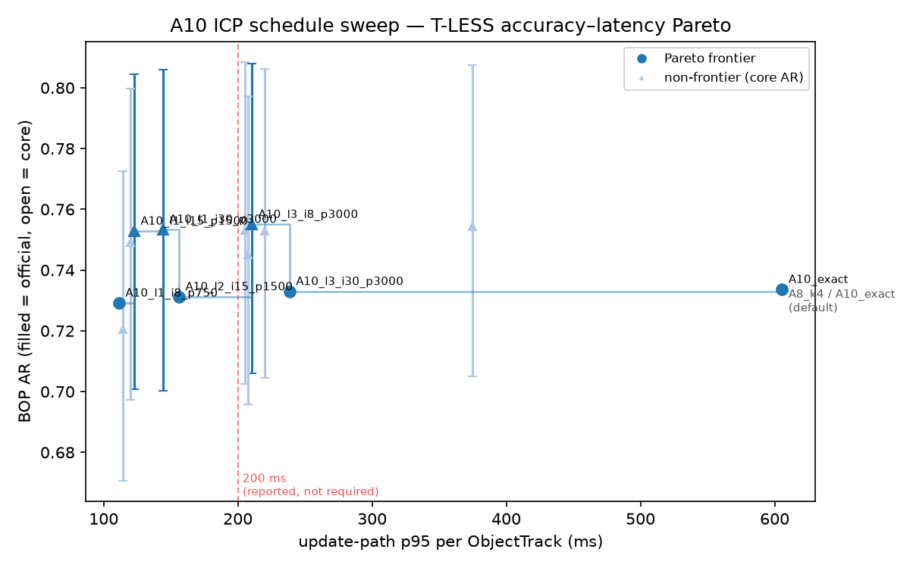

# Deployment milestone — T-LESS results (A10 ICP schedule sweep)

<!-- Provenance: generated by tools/deployment_report.py from outputs/ on the GPU machine
     (outputs/tless_deployment_pareto.json is the anchor). Regenerate with:
     uv run python tools/deployment_report.py --dataset tless
     Every number here comes from a file under outputs/. -->

Dataset: T-LESS (primary); XYZ-IBD (one cross-check row, core AR only)
Chain: A10 (A8 chain at k=4 views, ICP schedule coordinate sweep; baseline = A8_k4, official 75.9 AR)
Protocol: `configs/benchmark.yaml` (D13 frozen; 50 warm-up + 1000 timed ObjectTrack samples,
load average < 2.0, `perf_counter` per stage; no CUDA on the update path)

## Summary

- ROI crop (F1) + Class A fixes (F3/F4/F5/F5b/F7) applied to all rows except `A10_exact` reference.
- 200 ms p95 target: **reported, not required** (P2; see `docs/milestone_deployment_decision.md`).
  It is comfortably reachable: the chosen operating point (`A10_l2_i15_p1500`) measures **156 ms
  p95** (22 % margin below target) at **99.7 %** of the reference core AR.
- **The ICP schedule, not the ROI crop, is the dominant latency lever.** Dropping from 3→1
  correlation levels and 30→8 iterations costs under 1 official AR point (0.7337 → 0.7292, −0.45 pt)
  while cutting update-path p95 **5.4×** (605.6 ms → 111.6 ms). See P16 in the decision log.
- ROI crop alone (`A10_l3_i30_p3000`, same ICP schedule as the reference) is demoted to an
  ablation row per the pre-committed stop rule (P15): 2.05 % gate-flip rate and 21 mm max |Δt|
  against `roi=none` on real T-LESS rows.
- RQ-F finding (ADR-0001): after fixes, remaining hot paths (`registration_icp` ~66 ms, `cast_rays`
  ~90 ms/hypothesis) are already C++ inside Open3D; no Python hot spot survives; `cpp/` not created.
- Confidence ranking is worth **+2.87 AR points** even applied out of distribution on the cheapest
  schedule (`A10_l1_i15_p750` at 0.7492 vs its `score_signal=pose_score` control at 0.7205) —
  the D11 caveat about fitting on the default schedule's signal distribution does not break it.

## Accuracy–latency Pareto



Filled circles = official `bop_toolkit` AR (4 rows); open triangles = core AR only. Dark markers
sit on the Pareto frontier (min p95, max AR). Dashed red line = 200 ms target (reported, not
required). `A10_exact` is the reference / project default.

## Sweep table

| Row | Config | p50 ms | p95 ms | Core AR | Official AR | Frontier? |
|---|---|---:|---:|---:|---:|:---:|
| A10_exact | roi=none, L=3/I=30/P=3000 (reference) | 392.5 | 605.6 | 0.7562 | 0.7337 | ✓ |
| A10_l3_i30_p3000 | roi=bbox, L=3/I=30/P=3000 | 154.3 | 238.6 | 0.7553 | 0.7330 | ✓ |
| A10_l2_i30_p3000 | roi=bbox, L=2/I=30/P=3000 | 124.3 | 205.3 | 0.7530 | — | |
| A10_l1_i30_p3000 | roi=bbox, L=1/I=30/P=3000 | 94.5 | 144.2 | 0.7535 | — | ✓ |
| A10_l3_i15_p3000 | roi=bbox, L=3/I=15/P=3000 | 159.0 | 374.6 | 0.7544 | — | |
| A10_l3_i8_p3000 | roi=bbox, L=3/I=8/P=3000 | 132.7 | 210.5 | 0.7551 | — | ✓ |
| A10_l3_i30_p1500 | roi=bbox, L=3/I=30/P=1500 | 139.0 | 219.7 | 0.7529 | — | |
| A10_l3_i30_p750 | roi=bbox, L=3/I=30/P=750 | 128.7 | 207.4 | 0.7451 | — | |
| A10_l2_i15_p1500 | roi=bbox, L=2/I=15/P=1500 (**operating point**) | 95.7 | 156.2 | 0.7538 | 0.7313 | ✓ |
| A10_l1_i15_p1500 | roi=bbox, L=1/I=15/P=1500 | 75.1 | 122.9 | 0.7529 | — | ✓ |
| A10_l1_i8_p750 | roi=bbox, L=1/I=8/P=750 (**cheapest frontier point**) | 68.9 | 111.6 | 0.7509 | 0.7292 | ✓ |
| A10_l1_i15_p750 | roi=bbox, L=1/I=15/P=750 | 71.5 | 120.1 | 0.7492 | — | |
| A10_l1_i15_p750_posescore | roi=bbox, L=1/I=15/P=750, `score_signal=pose_score` (control) | 72.3 | 114.4 | 0.7205 | — | |

*Core AR = mean AR from `gt_rows.parquet` (bootstrap 95 % CI in
`outputs/tless_deployment_pareto.json`). Official AR = `bop_toolkit` `scores_bop19` for the 4 rows
selected in P16 (reference, ROI-cost, operating point, cheapest frontier point); others are core
AR only. Frontier = row lies on the Pareto frontier (min p95, max core AR).*

## XYZ-IBD cross-check (core AR only, D4)

| Row | Config | Core AR | 95 % CI |
|---|---|---:|---:|
| A10_l2_i15_p1500 | operating point cross-check, xyzibd | 0.4027 | [0.2803, 0.5327] |

No BOP19 GT exists for the xyzibd test split, so official AR is not computable for this row
(P4). The lower absolute AR versus T-LESS is consistent with XYZ-IBD's known difficulty at this
view count (Gamma milestone measured a similar ~0.38 range for XYZ-IBD val).

## Full-pipeline budget (D13's second target, no target set — P18/P19)

One real `tools/run.py` invocation, segment → evaluate, on a 2-scene × 12-image T-LESS subset
(seed 42, `outputs_root: outputs/bench`, isolated from the main cache tree).

| Stage | Total (s) | Per-image median (ms) | p90 | p95 | p99 | n |
|---|---:|---:|---:|---:|---:|---:|
| segment (CNOS) | 29.06 | 9312.4 | 9693.3 | 9792.0 | 9901.1 | 24 |
| coarse_pose (FoundPose, marginal) | 48.73 | 281.5 | 287.6 | 290.8 | 396.2 | 24 |
| refine (summed per image) | 24.87 | 964.6 | 2109.8 | 2158.9 | 2167.0 | 24 |
| associate | 0.22 | — (multi-view group, not per-image) | | | | |
| fuse | 0.22 | — (multi-view group, not per-image) | | | | |
| confidence | 0.03 | — (multi-view group, not per-image) | | | | |
| evaluate | 9.78 | — (whole-scene call, not per-image) | | | | |

**Wall time (segment → evaluate): 112.97 s.** Peak RSS 5861.1 MB, peak VRAM 7072.0 MB (whole
process tree / whole GPU, sampled every 0.2 s — the update-path leg's PID-matched samplers cannot
see the CNOS/FoundPose subprocess tree). Subset AR 0.8179 (272 predictions, 130 GT) — not
comparable to the full 20-scene numbers above; this leg reports no target (D13).

**`coarse_pose`'s number is FoundPose's own cost, not the raw column.** `hypotheses.parquet.time_s`
is cumulative by design (`= segment.time_s + FoundPose's own dt`, for BOP19's "one time per image"
convention) — verified against the full 1000-image A8_k4 run (`coarse_pose.time_s ≥ segment.time_s`
for all 1000 images). The table above subtracts `segment.time_s` per image to isolate FoundPose's
own contribution.

**Only `segment` and `refine` have genuine per-image granularity.** `associate`/`fuse`/`confidence`
operate on multi-view groups (one group spans 4 images) and `evaluate` scores a whole scene at
once; reporting a percentile for these would imply a distribution that was never measured, so only
their stage totals are given (P18).

**This wall time reflects CNOS/FoundPose's own persistent caches, not a from-scratch cold run
(P19).** Both adapters cache outside `outputs_root` — CNOS per-image (`data/work/cnos/results/
predictions/`), FoundPose per-dataset template/representation build (`data/work/foundpose/`) — and
every T-LESS scene has been processed by both across this project's A0–A10 ablations. The per-image
`time_s`/`seconds` values are trustworthy regardless (a deterministic model gives the same cost
whenever computed; cross-checked against the full A8_k4 run to within normal image-to-image
variance), but `stage_total_seconds`/`wall_seconds` may be faster than a genuinely first-ever-touch
run on a machine with empty caches.

## Latency protocol notes

- One sample = one ObjectTrack update (ADR-0004 unit). 1000 timed samples after 50 warm-up.
- No CUDA on the update path: `cuda_sync: not_applicable`, `peak_vram_mb: 0`.
- p95 over 1000 samples is the 950th value. Every percentile printed with its n.
- Load average enforced < 2.0 before timing starts (`tools/benchmark.py`).

## Reproduction

```bash
# On the GPU machine (k8s-control), from the repo root:
tools/run_deployment.sh
# Or step by step:
STEPS=equiv tools/run_deployment.sh          # Phase 3 cache proof
STEPS=sweep tools/run_deployment.sh          # ICP coordinate sweep (~3 h)
STEPS=bench tools/run_deployment.sh          # latency benchmark (after sweep)
STEPS=official tools/run_deployment.sh       # bop_toolkit for 4 rows (~3.5 h)
STEPS=xyzibd tools/run_deployment.sh         # XYZ-IBD cross-check (~20 min)
STEPS=full_pipeline tools/run_deployment.sh  # D13's second budget (~2 min, once)
STEPS=report tools/run_deployment.sh         # regenerate this doc and the PNG

# Full-pipeline leg directly (P18/P19):
uv run python tools/benchmark.py --dataset tless --full-pipeline
```

## Limitations

- XYZ-IBD cross-check: core AR only (no BOP19 GT for the xyzibd test split).
- Confidence model (Model H/F) fitted on the default-schedule signal distribution; cheap-schedule
  rows apply it out of distribution (D11). See `A10_l1_i15_p750_posescore` control row.
- p95 is specific to this host (Pascal TITAN X, no passwordless sudo, 1 MB/s LAN).
- Full-pipeline `stage_total_seconds`/`wall_seconds` reflect CNOS/FoundPose's own persistent
  per-image/per-dataset caches (outside `outputs_root`), not a from-scratch cold run; the per-image
  `time_s`/`seconds` values are unaffected (P19).
- `associate`/`fuse`/`confidence`/`evaluate` in the full-pipeline leg have no per-image percentile
  (they operate on multi-view groups or whole scenes); only their stage totals are reported (P18).
