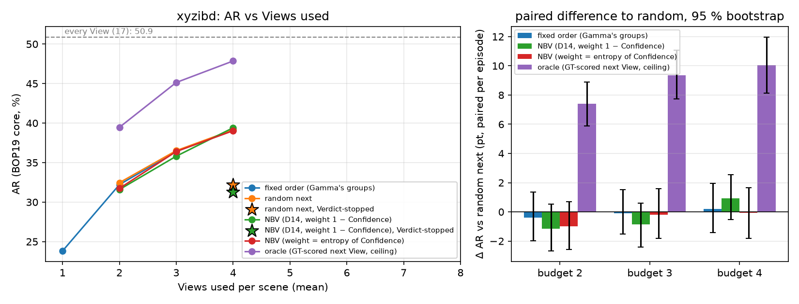
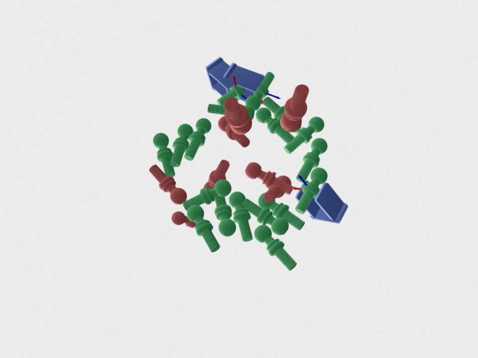

# Epsilon results — next-best-view over real Views (XYZ-IBD + T-LESS)

Milestone 6a, started 2026-09-19, **closed 2026-09-23** (exit criterion not met, reported as a
negative result with its ceiling — see Summary). Research question RQ-E: *does uncertainty-driven
next-best-view over the Scene's real Views beat fixed and random view orders on AR-vs-views?*
Decisions in [`milestone_epsilon_decision.md`](milestone_epsilon_decision.md); the tool-written
analyses are `outputs/{xyzibd,tless}_epsilon_report.md` (`tools/nbv_report.py`), one row per
`tools/run_epsilon.sh` invocation, verified by `tools/check_epsilon.py` (0 failures on both
datasets). Every number here comes from those files.

**Coverage.** XYZ-IBD val: all four start groups (60 episodes per policy/budget, 6 384 GT
instances) — the primary dataset for RQ-E (D14: "Candidate Viewpoints are the remaining real
Views of a multi-view Scene (XYZ-IBD / IPD)"). T-LESS test: start group 0 (20 episodes, 533 GT),
run as a second dataset to see whether the finding is XYZ-IBD-specific; it is not.

## Summary

- **Every extra View is worth a lot; *which* View is worth nothing to the D14 score.** On XYZ-IBD
  (60 episodes) a second View lifts AR from 23.8 to ~32, a fourth to ~39, all seventeen to 50.9.
  NBV, random next and Gamma's strided order land within 1.1 pt of each other at every budget, and
  the paired 95 % interval of NBV − random spans zero at every budget: −1.14 [−2.68, +0.53] /
  −0.85 [−2.40, +0.61] / +0.93 [−0.51, +2.56] pt at 2 / 3 / 4 Views. T-LESS (20 episodes) agrees:
  −1.3 [−7.6, +4.2] / +0.7 [−5.7, +6.2] / −2.9 [−8.3, +2.3]. **The exit criterion — NBV beats
  random next — is not met, on either dataset, at any budget.**
- **View choice itself matters enormously.** A GT-scored oracle that unlocks the View whose belief
  update matches the most annotated instances reaches 39.5 / 45.1 / 47.9 AR with 2 / 3 / 4 Views on
  XYZ-IBD — every interval clear of zero and growing with more data (+7.4 [+5.9, +8.9] / +9.4
  [+7.7, +11.1] / +10.0 [+8.1, +12.0] pt over random) — and 79.5 / 85.1 / 85.3 on T-LESS (+13.1 /
  +17.0 / +10.7). Three oracle-chosen XYZ-IBD Views (45.1) already approach the fixed four-View row
  plus 6 pt; the ceiling is real and large. The D14 score does not reach for it.
- **Why: the worth of a View is what the detector will find in it, not its geometry.** Within a
  scene the oracle's per-candidate gain correlates 0.71 (Spearman, XYZ-IBD, 60 episodes) with the
  number of *correct single-view hypotheses that image contributes* (CNOS + FoundPose success in
  that image), 0.37 with the number of hypotheses in it, and 0.04 with the D14 score; the D14
  score's own correlation with detection success is 0.00. T-LESS: 0.62 / 0.30 / 0.10 / 0.03 — the
  same ordering. Silhouette disagreement measures how much a View could tell about a pose that is
  already tracked; on both datasets the gain instead comes from Views in which the detector finds
  the copies the first View missed — unobservable from geometry before the image is taken.
- **The Verdict-stopped loop (D14 as written) does not beat a fixed budget with the published
  thresholds.** Averaged over all four XYZ-IBD start groups, both the NBV-driven and the
  random-driven loop settle at ~4.0 Views (the same as the fixed budget-4 row) but reach only 31.2
  / 32.2 AR against the fixed row's 39.1 — worse than picking a budget and stopping, because
  `request_view` (3–6 % of tracks) does not mark the scenes that would gain from another View: 2 of
  4 XYZ-IBD start groups saw some scenes exhaust all 17 Views on a track that never resolved, and
  T-LESS's NBV-driven loop stopped every one of its 20 episodes on `stop:verdict` at a mean of 3.05
  Views for 61.4 AR, 11 points under the same-budget random row.
- The entropy track weight (E10) does not change the conclusion: −0.99 [−2.57, +0.70] / −0.20
  [−1.81, +1.57] / −0.07 [−1.80, +1.65] pt vs random on XYZ-IBD across all four groups.
- The grasp chain `T_robot_gripper = T_robot_world @ T_world_object @ T_object_gripper` is
  implemented, tested and drawn (§5); this part of the exit criterion is met.

## 1. Protocol

An episode is one scene and a start View (the first image of Gamma's strided group `g`); the
Candidate Viewpoints are the scene's other target images (17 on XYZ-IBD val, 50 on T-LESS); a
policy unlocks Views until its budget is spent (or, for the Verdict-stopped rows, until no
ObjectTrack says `request_view`). After every unlocked View the belief is recomputed with the A8
chain — association, weighted SE(3) mean, Model F Confidence, Verdict — and the final FusedPoses
are projected into the episode's *reference Views* (the four images of strided group `g`), the
same for every policy, so policies are paired by GT instance and `fixed` with budget 4 is
exactly the A8 `k = 4` group (`tools/check_epsilon.py` asserts the per-GT errors agree on all
four XYZ-IBD groups and on T-LESS `g0`). AR is the core evaluator's BOP19 protocol on those
images; the paired differences bootstrap the per-episode mean of the per-GT recall approximation
over episodes.

Policies: `fixed` (the strided order), `random` (one permutation per episode, nested across
budgets), `nbv` (D14: `S(v) = Σ_t w_t · U_t(v) · V_t(v)`, `U` the mean pairwise silhouette
disagreement of the track's aligned members plus posterior samples rendered into `v`, `V` the
predicted visible fraction, `w = 1 − Confidence`), `nbve` (`w` = the binary entropy of the
Confidence), `oracle` (the View whose belief update matches the most distinct annotated instances
of the reference Views with a successful FusedPose — reads the ground truth, an upper bound).

## 2. AR vs Views used — XYZ-IBD val, all four start groups (60 episodes, 6 384 GT)

| policy | Views | AR | VSD | MSSD | MSPD | paired Δ vs random [95 %] |
|---|---|---|---|---|---|---|
| fixed (strided) | 1 | 23.8 | 21.7 | 24.8 | 25.0 | — |
| fixed (strided) | 2 / 3 / 4 | 32.2 / 36.4 / 39.1 | 29.0 / 32.8 / 35.0 | 33.9 / 38.5 / 41.5 | 33.7 / 37.9 / 40.8 | −0.4 [−1.9, +1.1] / −0.1 [−1.6, +1.4] / 0.0 [−1.6, +1.6] |
| fixed, every View | 17 | 50.9 | 44.5 | 54.7 | 53.4 | — |
| random next | 2 / 3 / 4 | 32.5 / 36.5 / 39.1 | 29.3 / 32.5 / 34.7 | 34.2 / 38.7 / 41.6 | 33.9 / 38.3 / 41.1 | 0 |
| **NBV (D14)** | 2 / 3 / 4 | **31.6 / 35.8 / 39.4** | 28.5 / 32.3 / 35.5 | 33.2 / 37.9 / 41.9 | 33.0 / 37.2 / 40.8 | −1.14 [−2.68, +0.53] / −0.85 [−2.40, +0.61] / +0.93 [−0.51, +2.56] |
| NBV, entropy weight | 2 / 3 / 4 | 31.7 / 36.4 / 39.0 | 28.7 / 32.9 / 35.2 | 33.5 / 38.5 / 41.5 | 33.0 / 37.9 / 40.4 | −0.99 [−2.57, +0.70] / −0.20 [−1.81, +1.57] / −0.07 [−1.80, +1.65] |
| oracle (ceiling) | 2 / 3 / 4 | 39.5 / 45.1 / 47.9 | 36.0 / 41.1 / 43.6 | 41.5 / 47.5 / 50.3 | 40.9 / 46.8 / 49.7 | **+7.39 [+5.89, +8.89] / +9.36 [+7.73, +11.07] / +10.04 [+8.13, +11.97]** |
| NBV, Verdict-stopped (mean of 4 groups) | 4.00 | 31.2 | — | — | — | — |
| random, Verdict-stopped (mean of 4 groups) | 4.00 | 32.2 | — | — | — | — |



## 3. AR vs Views used — T-LESS test, start group 0 (20 episodes, 533 GT)

| policy | Views | AR | paired Δ vs random [95 %] |
|---|---|---|---|
| fixed (strided) | 1 | 52.2 | — |
| fixed (strided) | 2 / 3 / 4 | 65.4 / 69.9 / 72.6 | +1.27 / +0.54 / +0.84 |
| fixed, every View | 50 | 84.1 | — |
| random next | 2 / 3 / 4 | 66.4 / 68.2 / 74.6 | 0 |
| **NBV (D14)** | 2 / 3 / 4 | **67.1 / 70.5 / 74.4** | −1.34 [−7.56, +4.20] / +0.73 [−5.68, +6.18] / −2.90 [−8.33, +2.29] |
| NBV, entropy weight | 2 / 3 / 4 | 63.0 / 71.7 / 77.5 | −5.30 [−12.59, +1.38] / +3.31 [−3.22, +9.91] / +2.11 [−1.38, +5.92] |
| oracle (ceiling) | 2 / 3 / 4 | 79.5 / 85.1 / 85.3 | **+13.13 [+5.75, +20.05] / +16.99 [+8.92, +24.96] / +10.67 [+5.91, +15.88]** |
| NBV, Verdict-stopped | 3.05 (1–26) | 61.4 | — |
| random, Verdict-stopped | 4.70 (1–50) | 62.8 | — |

Three oracle-chosen Views (85.1) beat all fifty (84.1): the choice is made on the reference
Views' annotations, so it is a ceiling with the test in the loop, not a reachable number.

## 4. What decides a View's worth

Within-scene Spearman correlation of the oracle's per-candidate gain after the first View:

| correlate of the candidate View | XYZ-IBD (60 episodes) | T-LESS (20 episodes) |
|---|---|---|
| successful single-view hypotheses in that image (detector + estimator; needs the ground truth) | **0.71** | **0.62** |
| hypotheses in that image (needs the image) | 0.37 | 0.30 |
| the D14 score of that View (geometry only, computable before the image) | 0.04 | 0.10 |
| the D14 score vs successful hypotheses | 0.00 | 0.03 |

The oracle's picks are not geometrically special either: mean angle to the nearest used View
12.4° (XYZ-IBD) / 36.3° (T-LESS) against 9–15° / 37–58° for the other policies — inside the
policies' own spread, not at an extreme. On XYZ-IBD scene 0 the oracle's second View is 3° from
the first — the *closest* candidate — where the D14 score chose the widest baseline (19°). The
D14 mechanism (a View that sees the depth ambiguity of a tracked pose from the side) is real and
recovered by the synthetic test (`tests/test_active.py`), but on both these bins the pose error
after depth-initialised ICP and fusion is not what limits AR; the detector's recall is (Gamma:
CNOS finds fewer than half of the 10–59 copies on XYZ-IBD), and a View's contribution is the
copies it adds — unobservable before the image is taken.

Cost: 0.9–3.7 s per candidate View for the D14 score depending on machine load (17 tracks × 7
silhouettes at 360 × 270 plus one scene render on XYZ-IBD); the oracle's belief updates cost
under 1 s per candidate with 500-point labelling.

## 5. Simulated pick

`binposert/viz/grasp.py`: a Grasp Pose per ObjectModel (`models/grasps/xyzibd.json`, 15 objects,
seeded from the bounding box — jaws across the smallest extent, approach along the middle one —
and editable by hand), `pick_transform` spelling out
`T_robot_gripper = T_robot_world @ T_world_object @ T_object_gripper`, and an Open3D offscreen
drawing of the Scene's FusedPoses coloured by Verdict (green accept, amber request_view, red
reject), the used camera frames and the gripper at the most confident accepted picks.
`tools/grasp_demo.py --dataset xyzibd --row A9_nbv_b4_g0 --scene 0` prints the chain matrix by
matrix and writes the figure; `T_robot_world` places a robot base 600 mm from the world origin
(the dataset has none).



## 6. Reproduction

```bash
tools/run_epsilon.sh                                   # every row on xyzibd, start groups 0..3
START_GROUPS="0" DATASET=tless tools/run_epsilon.sh    # T-LESS, one start group
uv run python tools/nbv_report.py --dataset xyzibd     # tables, curve, JSON
uv run python tools/check_epsilon.py --dataset xyzibd --groups 0 1 2 3
uv run python tools/grasp_demo.py --dataset xyzibd --row A9_nbv_b4_g0 --scene 0
```
