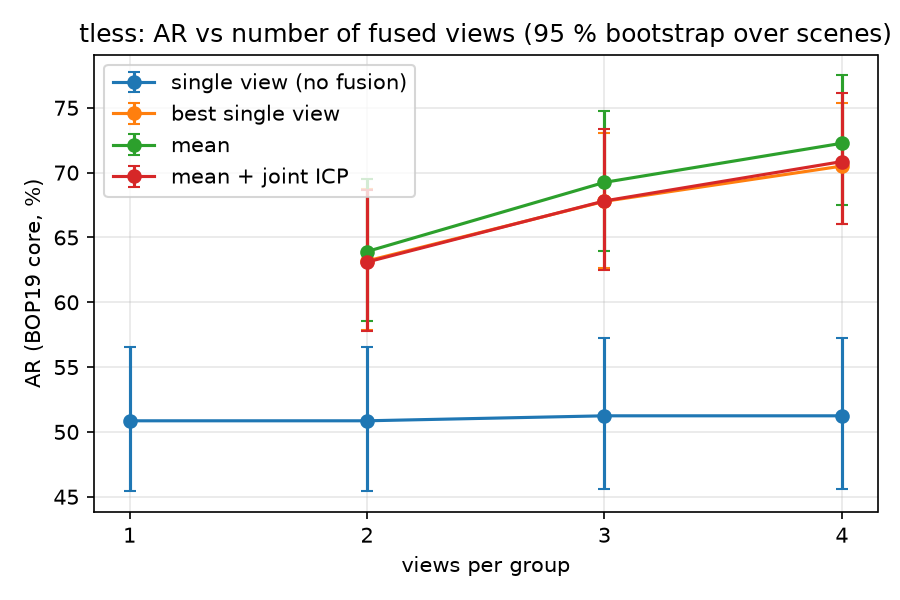
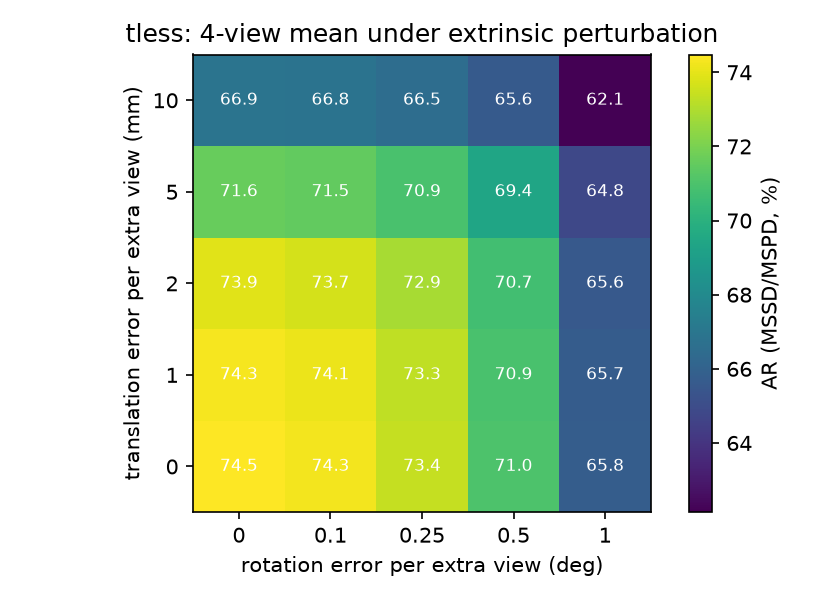

# Gamma results — T-LESS (multi-view debug set)

Milestone 4, 2026-09-16. Multi-view association and fusion (D10) on top of Beta's chain
(CNOS → FoundPose → depth-initialised point-to-plane ICP with the tuned gate), on T-LESS BOP19
targets read as calibrated view groups (D5). Every number comes from one `tools/run.py` row under
`outputs/runs/<row>_tless/` (D12); `tools/run_gamma.sh` re-creates all of them and
`tools/multiview_report.py` renders `outputs/tless_gamma_report.md`, from which this page is curated.
The decision log is [`milestone_gamma_decision.md`](milestone_gamma_decision.md).

AR in %, BOP19 protocol; *core* = `binposert.evaluate`, *official* = `bop_toolkit` on the same images.
All rows use the corrected depth (§1). Error bars: 95 % bootstrap over scenes.

## 1. The depth↔RGB offset, estimated without ground truth (closes B20)

`tools/depth_rgb_offset.py` aligns depth discontinuities to RGB edges (CNOS masks focus the edges on
objects; robust inlier score; images without a clear peak dropped) on val scenes {1, 6, 11, 16}:
**du = −0.19 px, dv = −3.28 px** (≈ −2.4 mm at 775 mm) — the depth map sits 3.3 px too low, the size and
direction of the ICP bias Beta measured against GT. Applied as `dataset.depth_shift_px` (part of every
depth-reading stage's cache hash).

| | val scenes (GT read, not used) | all 20 scenes, single view (A2 chain, 1000 images) |
|---|---|---|
| ICP translation error of good fits (dx, dy, dz) | (+0.49, **+2.39**, −0.37) → (+0.52, **+0.56**, −0.31) mm | — |
| per-hypothesis success / within 0.05 d | 64.0 → 66.8 % / 24.6 → 39.0 % | — |
| core AR (VSD / MSSD / MSPD) | — | **47.55 → 50.86** (41.5 → 48.0 / 50.1 → 51.5 / 51.0 → 53.2) |
| official AR | — | 47.8 → **51.1** |

A two-number sensor constant, estimated on eight val images, is worth +3.3 AR — the largest single change
since the depth initialisation.

## 2. AR vs number of views (RQ-C)

View groups: `n // k` disjoint strided groups per scene of the 50 target images (k = 3, 4 use 48 of
50); every row is scored on its groups' images only, so the single-view reference is exact.

| views | single view (no fusion) | best single view | **mean** (A6) | mean + joint ICP (A7) |
|---|---|---|---|---|
| 1 | 50.9 / **51.1** [45.4, 56.6] | — | — | — |
| 2 | 50.9 / **51.1** [45.4, 56.6] | 63.2 / **63.5** [57.9, 68.7] | **63.9 / 64.2** [58.5, 69.5] | 63.1 / **63.4** [57.8, 68.7] |
| 3 | 51.2 / **51.5** [45.6, 57.3] | 67.8 / **68.1** [62.7, 73.1] | **69.2 / 69.5** [63.9, 74.7] | 67.8 / **68.2** [62.5, 73.4] |
| 4 | 51.2 / **51.5** [45.6, 57.3] | 70.5 / **70.9** [66.0, 75.3] | **72.3 / 72.5** [67.5, 77.5] | 70.9 / **71.2** [66.1, 76.1] |

core / **official** [bootstrap 95 % interval of core]; core and official agree within 0.4 pt on every row.

Per metric (core), mean fusion: k = 1 → 4 takes VSD 48.0 → 67.8, MSSD 51.4 → 73.9, MSPD 53.2 → 75.0.
Predictions per row grow from 5452 (k = 1) to 11 924 (k = 4): a FusedPose is a world-frame object and is
predicted in every View of its group, which is where most of the gain comes from — CNOS misses ~15 % of
the targets in any one View, and an object seen in one View is now localised in all of them.

**By visibility** (core AR, k = 4 groups, 960 images):

| GT visible fraction | n GT | single view | 2-view mean | 4-view mean |
|---|---|---|---|---|
| [0.1, 0.3) | 149 | 1.1 | 29.5 | **40.0** |
| [0.3, 0.6) | 650 | 14.1 | 41.6 | **51.8** |
| [0.6, 1.0] | 5412 | 57.1 | 67.7 | **75.6** |

The largest relative gains are on occluded objects, which another View sees unoccluded.

**Reading.** Selecting the best-weighted View and projecting it everywhere is already +12 to +19 AR;
averaging the symmetry-aligned members adds +0.7 to +1.8 on top, growing with k (789 / 1289 / 1604 of the
multi-view tracks needed a symmetry-branch alignment before averaging; median dispersion of the members
about the mean 1.7–2.0 mm / 2.0–2.5°). The joint ICP polish (D10 step 4) is *below* the mean at every k
(−0.8 / −1.4 / −1.4): per track it is neutral on single-member tracks and worsens multi-member ones
(3-member tracks: median world MSSD 2.95 → 3.70 mm, 40 % worsened by > 1 mm vs 6 % improved) — the union
of several Views' clouds carries each View's residual calibration and registration error as an
inconsistent surface, whereas the mean of per-view poses averages those errors out. D10 step 4 is
therefore not part of the default path (decision G17); A7 documents it.

## 3. Association correctness (repeated objects, vs GT instances)

BOP keeps one `gt_index` per physical object across the Views of a static scene (verified), so an
instance is `(scene_id, gt_index)`; every hypothesis is labelled with the nearest same-object instance in
its View (within 0.5 d).

| views | groups | tracks | multi-view tracks | labelled hyps | track purity | member purity | completeness | mixed tracks | split instances |
|---|---|---|---|---|---|---|---|---|---|
| 2 | 500 | 4265 | 1187 | 3826 | **100.0** | 100.0 | 95.4 | 0 | 124 of 1232 |
| 3 | 320 | 3407 | 1323 | 3723 | **100.0** | 100.0 | 95.2 | 0 | 155 of 1256 |
| 4 | 240 | 2981 | 1230 | 3723 | **100.0** | 100.0 | 95.0 | 0 | 174 of 1126 |

No track ever joined two physical objects (gate 0.5 d / 45°, symmetry-aware, one-to-one per View).
The ~5 % incompleteness is instances whose hypothesis in some View is wrong by more than the gate —
correctly kept out of the average; T-LESS has few repeated objects per scene, so the XYZ-IBD numbers
(10–59 copies per bin) are the real test of purity.

## 4. Extrinsic perturbation sweep

Every View but the first of a 4-view group gets a rigid perturbation of `T_world_camera` in its camera
frame (random direction, seeded), before association and fusion; mean fusion; core AR without VSD (mean
of MSSD and MSPD), so the unperturbed cell reads 74.5 where the table above reads 72.3.

| δt mm \ δθ ° | 0 | 0.1 | 0.25 | 0.5 | 1 |
|---|---|---|---|---|---|
| 0 | 74.5 | 74.3 | 73.4 | 71.0 | 65.8 |
| 1 | 74.3 | 74.1 | 73.3 | 70.9 | 65.7 |
| 2 | 73.9 | 73.7 | 72.9 | 70.7 | 65.6 |
| 5 | 71.6 | 71.5 | 70.9 | 69.4 | 64.8 |
| 10 | 66.9 | 66.8 | 66.5 | 65.6 | 62.1 |

Fusion degrades gracefully: 2 mm / 0.25° of calibration error costs < 2 pt; 10 mm / 1° (≈ 12 mm of
image-plane displacement at 700 mm) costs 12 pt and still leaves the 4-view mean 9 pt above the
single-view reference (52.7 in the same metric). Rotation matters more than translation per unit of
lever arm, as expected at 0.7 m.

## 5. Costs

Association 4–10 s per row (500 groups); mean fusion 3–5 ms per track; joint ICP 1.0 s per track
(k = 2: 8 min per row on 15 cores); evaluation with VSD ~8 min per row. The update path for one new View
(associate + fuse a scene) is milliseconds once the single-view refinement exists.

## 6. Provenance

- Refine stage (A2 chain on corrected depth): `outputs/tless/test_primesense/refine/4b2c96bd22ffdeae`
- k = 1 evaluate `2518f899a12f2f85`; k = 2 mean: associate `d3f3b75e118c6209`, fuse `0d9ee735efb602fb`,
  evaluate `ffb097eb95a5d0fa`; k = 4 mean: associate `a36f6f188e0b5033`, fuse `2ea8b37d26c8682f`,
  evaluate `052a6055eaf1c209`; every row: `outputs/runs/<row>_tless/run_manifest.json`
- Galleries per multi-view row: `<fuse dir>/analysis/gallery/` (`symmetry_flips.png`, `joint_*.png`;
  no `mixed.png` because there were no mixed tracks); association labels
  `<associate dir>/analysis/labelled_tracks.parquet`
- Rows before the depth correction (k ≤ 2, for the record): `outputs/runs/noshift/`
- Offset estimate: `outputs/tless_depth_rgb_offset.json`
