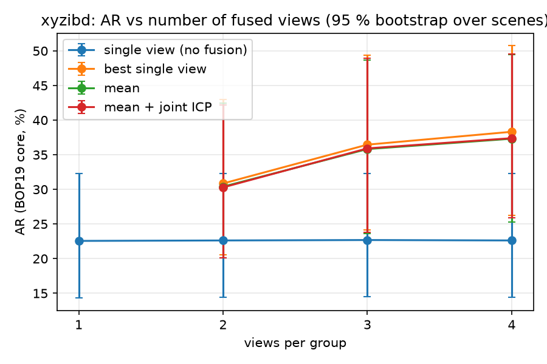
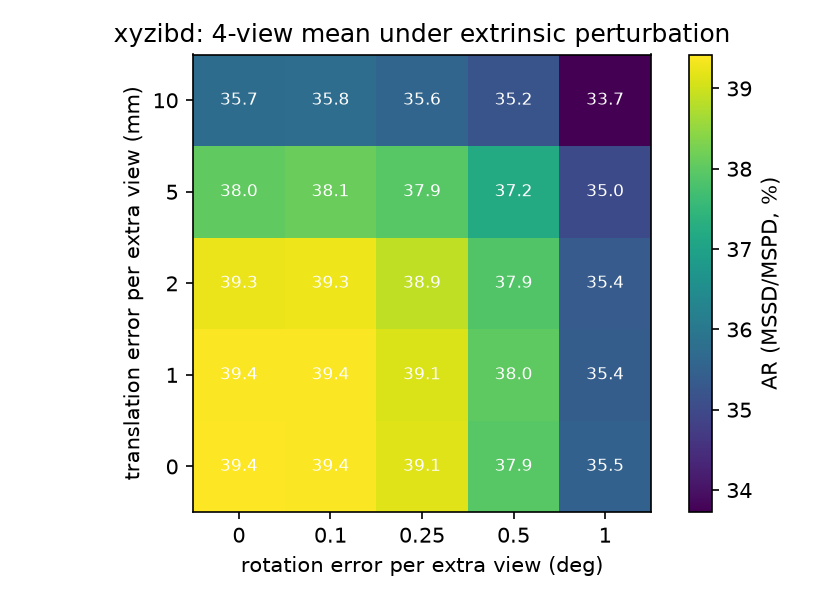

# Gamma results — XYZ-IBD (multi-view centrepiece, `val` split)

Milestone 4, 2026-09-17. The same rows as [`results_gamma_tless.md`](results_gamma_tless.md) on
XYZ-IBD (BOP 2025), read through the `xyz` camera view (`tools/bop_camera_view.py`, decision G11):
grayscale 1440 × 1080 structured-light images, 15 val scenes with one part type each and 10–59 copies
per bin, 50 calibrated views per scene of which every third is used (17 per scene, 255 images, 6783
GT instances; `val_targets_gamma.json`). The test split has no public ground truth, so val is the
evaluation split for Gamma and Delta. CNOS → FoundPose (both onboarded on this dataset: 15 objects) →
point-to-plane refinement (Beta's tuned gate) → association → fusion, all from `tools/run_gamma_xyzibd.sh`;
numbers from `outputs/runs/<row>_xyzibd/`, report `outputs/xyzibd_gamma_report.md`,
closure test `tools/check_gamma.py --dataset xyzibd` (all 123 checks pass).

AR in %, BOP19 protocol, **core evaluator only** (bop_toolkit has no XYZ-IBD `val` targets; the core
evaluator agrees with it within 0.4 pt on every T-LESS row). No depth shift: the `xyz` sensor's gray
image and depth are co-registered (0 ± 0.5 px on 20 val images, G19). Error bars: 95 % bootstrap over
the 15 scenes — wide, because each scene is one part type and the per-object numbers range 4–45.

## 1. Single view

| | AR | VSD | MSSD | MSPD | predictions / GT |
|---|---|---|---|---|---|
| CNOS + FoundPose + refinement, 255 images | **22.6** [15.1, 33.1] | 20.4 | 23.4 | 23.9 | 3111 / 6783 |

The detector is the ceiling: CNOS on the grayscale bins finds fewer than half the instances (17 of 31 in
the first val image, ~46 % overall), and only detected instances can be posed. Per object (MSSD AR):
1: 4, 2: 41, 4: 34, 5: 12, 6: 35, 8: 7, 9: 4, 10: 21, 11: 17, 12: 21, 13: 35, 14: 44, 15: 14, 16: 45,
17: 42 — the rod-like parts (1, 9) and the 23 k-vertex part 8 are the hard ones.

## 2. AR vs number of views (RQ-C)

| views | single view (no fusion) | best single view | mean (A6) | mean + joint ICP (A7) |
|---|---|---|---|---|
| 1 | 22.6 [15.1, 33.1] | — | — | — |
| 2 | 22.6 [15.2, 33.1] | **30.9** [21.6, 44.0] | 30.4 [21.3, 43.6] | 30.3 [21.3, 43.4] |
| 3 | 22.7 [15.3, 33.1] | **36.5** [25.4, 50.7] | 35.8 [24.9, 50.1] | 35.9 [25.2, 50.2] |
| 4 | 22.6 [15.2, 33.1] | **38.3** [27.6, 52.2] | 37.3 [26.9, 51.1] | 37.4 [27.4, 51.1] |

Four calibrated views take AR from 22.6 to 37–38 (+15 pt, +66 % relative), on 240 images with 7704
predictions against 2924 for single view: as on T-LESS, most of the gain is an object seen in one View
being localised in all of them, which matters most when the detector misses half the copies.

Unlike T-LESS, **`best` beats `mean` by 0.5–1.0 pt** here and the joint polish is neutral. The members
of a track agree to a median 0.4–0.8 mm / 1.0–1.8° (T-LESS: 1.7–2.0 mm / 2.0–2.5°): a structured-light
sensor with per-pixel-registered depth leaves almost nothing for averaging to cancel, while the
highest-weight member carries the better *detection* — the failure mode on this data is a wrong or
mixed member, not a noisy one, and averaging in a wrong member costs more than averaging a noisy one
gains. Both rows stay far above single view at every k; the default stays `mean` (D10) because it wins
where per-view errors are the problem (T-LESS) and loses under a point where they are not.

## 3. Association correctness on repeated objects

This is the test T-LESS could not give: 10–59 identical copies per bin, often stacked and touching.

| views | groups | tracks | multi-view tracks | labelled hyps | track purity | member purity | completeness | mixed tracks | split instances |
|---|---|---|---|---|---|---|---|---|---|
| 2 | 120 | 2372 | 552 | 2176 | 92.8 | 96.4 | 88.6 | 39 | 193 of 647 |
| 3 | 75 | 2002 | 546 | 2045 | 92.1 | 96.7 | 87.0 | 42 | 218 of 614 |
| 4 | 60 | 1926 | 579 | 2176 | 89.4 | 95.9 | 85.8 | 59 | 233 of 595 |

Labels: nearest GT instance of the object in the member's View, within 0.5 d. 90–93 % of multi-member
tracks contain one physical copy only; 96 % of members agree with their track's majority copy; 86–89 %
of the (copy, View) pairs sit in the copy's largest track. The `mixed.png` gallery of the k = 4 row shows
what the 7–10 % mixed tracks are: ball-studs lying on top of each other, where a member pose sits between
two copies less than half a diameter apart and the per-View label flips between them — partly genuine
mis-association (the gate of 0.5 d cannot separate copies that are closer than that), partly label
ambiguity of poses that are wrong in the first place. A tighter gate would split more correct tracks
(completeness is already the weaker number); the honest reading is that a translation gate alone is
what limits association in dense bins, and a mask-overlap or appearance term would be the next step.

## 4. Extrinsic perturbation sweep

4-view `mean`, core AR without VSD (mean of MSSD and MSPD; the unperturbed cell reads 39.4 where the
table above reads 37.3):

| δt mm \ δθ ° | 0 | 0.1 | 0.25 | 0.5 | 1 |
|---|---|---|---|---|---|
| 0 | 39.4 | 39.4 | 39.1 | 37.9 | 35.5 |
| 1 | 39.4 | 39.4 | 39.1 | 38.0 | 35.4 |
| 2 | 39.3 | 39.3 | 38.9 | 37.9 | 35.4 |
| 5 | 38.0 | 38.1 | 37.9 | 37.2 | 35.0 |
| 10 | 35.7 | 35.8 | 35.6 | 35.2 | 33.7 |

2 mm / 0.25° of calibration error costs 0.5 pt; 10 mm / 1° costs 5.7 pt and the 4-view mean is still
10 pt above the single-view reference (23.7 in the same metric). Flatter than T-LESS because the
objects are smaller relative to the working distance and the detector, not the geometry, dominates.

## 5. What it cost

CNOS: ~45 s per 1440 × 1080 image once the CPU is free (SAM post-processing; GPU 100 % in bursts),
after a 3.7 GB proposal batch had to be chunked (G18). FoundPose: onboarding 15 objects ≈ 2 h
(templates 2 min, representation 6 min per object), inference 0.31–0.36 s per instance. Refinement:
3111 hypotheses in 16 min on 15 cores. Evaluate with VSD: ~22 min per row at this resolution (each pose
rendered once per image, G-evaluate). Joint ICP: 2.6 s per track (10 s at k = 4). Association: seconds.

## 6. Provenance

`outputs/xyzibd/val/`: segment `1bf69ec3bd0bb040` (15 967 detections), coarse_pose `b15c0…`
(3111 hypotheses), refine `fef89a25556…`; rows `outputs/runs/<row>_xyzibd/run_manifest.json`;
galleries under each fuse dir's `analysis/gallery/` (`mixed.png`, `symmetry_flips.png`, joint rows
`joint_*.png`); association labels `<associate dir>/analysis/labelled_tracks.parquet`; offset estimate
`outputs/xyzibd_depth_rgb_offset.json`; the dataset view `data/bop/xyzibd_xyz/` and its
`val_targets_gamma.json`; upstream patches `docker/cnos/patch.sh` (#1–2), `docker/foundpose/patch.sh`
(#2–4). Row logs of the eight restarts (reboots, OOM, template/viewport failures, a hung pool) are
kept as `outputs/runs/run_gamma_xyzibd_part*.log`.
